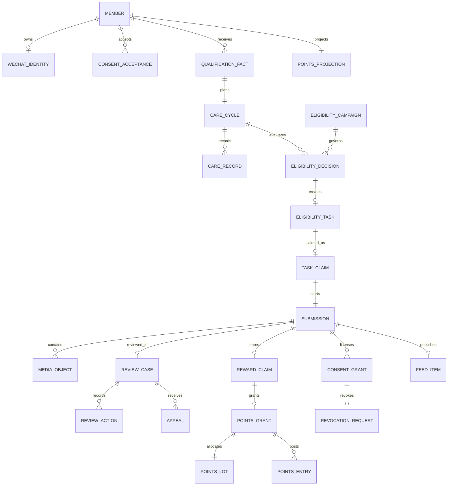

# R0 entity relationship model

The SQL migration is authoritative; this view highlights the first vertical slice.

Cross-cutting tables are `outbox_event`, `idempotency_operation`, `principal_role`, `audit_log` and `emergency_switch`. Server-generated UUIDs and uniqueness constraints are the authority; clients do not allocate business identifiers.
