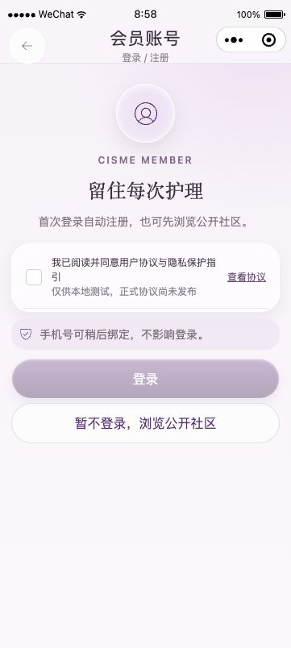

# R5：真实支付接线已完成准备；main、生产切换和上传尚未执行

2026-09-26；唯一工程 `/Users/mini/CISME`，原分支 `codex/fulfillment-lifecycle-20260922`、PR22。所有时间以各回执中的 UTC 为准。R3/R4 的真实恢复、23→95 迁移、对象探针和既有原生证据保持原范围，没有重新执行相同演练。

| 交付线 | 本轮实际结果 |
| --- | --- |
| 支持 | R5 对原允许会话作一次有界检查：邮箱及补充材料已提交，未见新增人工受理编号或原 GitHub 写入恢复许可。没有把 AI 回复、邮箱收到或 mergeable=true 当作解除；没有换通道写仓库或重访被拒商户站点。 |
| 原分支 / main | 本轮起点 `18a200bd60ef83f60b96c873f8dca6324db199ee`，tree `714d50268c27faa8c39c56ce0e4eaf1e159bae2b`，起始工作树干净。最终完整受测源码 `f62719e6fc896f18d18a84d3b1c25d06b0d38363`，tree `e7450768b67fdd3f4afeb9990b00deb9d66a6817`。后续报告提交按差异另行继承。 |
| 远端回读 | [PR22](https://github.com/Eysn0130/cisme-wechat-miniapp/pull/22) 仍为 Open / Draft / merged=false，HEAD `5ab4a00d4e71d8a9a2de14e31b64fca0bbe92e88`；main `5740e18544fa37dd473c36934a2a12a07a2d5ec9`。新候选 CI 未运行。见 [github-status.json](github-status.json)。 |
| 支付 | 用户提供的真实商户、证书/私钥、APIv3、公钥及 ID 已接入生产准备配置。真实一次只读查询得到验签通过的 HTTP404 / `ORDER_NOT_EXIST`，应用分类 `WECHAT_PAY_ORDER_NOT_FOUND`。请求公钥 ID 与响应签名 ID 一致；没有创建订单、扣款或退款。 |
| 履约 | 自定义有限授权、运行身份和代码链已接好。两个官方账户状态接口实际均返回 HTTP200 / errcode48001，状态仍未知，不能宣布微信发货管理及结算确认完成。见 [观察记录](shipping-readiness-observation.json)。 |
| 私有输入 | 最终目录 `/etc/cisme-wechat-pay`，9 个材料文件；安装器绑定8个实际运行输入（7个 env 文件键及清单引用的公钥）。root 管理父目录，文件 cisme: cisme 0600；API/worker 对应身份与 sandbox 复验通过。完整摘要、属主、权限、父目录及 env 摘要只存在服务器私有回执。 |
| 生产 | 2026-09-26T16:03:45Z 回读仍为 `/opt/cisme/releases/20260909-native-login`、APP_ENV=staging、23条迁移、2条身份事件待处理；API PID100151、worker PID100155，均 active。准备文件不是 live 安装，没有切 current、迁移 live 库或开放防火墙。 |
| 小程序 | 有效输入仍为 `e97db4690df66ae2c86b2e9539a5d631afbc501a27489fc32dc21c32ec436a4a`，266文件/40路由。开发者工具登录有效，当前账户页观察已保存。最终 main 上传和平台版本回读 NOT_RUN；iOS/Android NOT_RUN。 |

## 修复、真实验证和边界

`wechatPayV3.ts` 的本地原实现确实缺少公钥模式请求头。本轮为普通请求及账单下载增加 `Wechatpay-Serial`，由已校验的可信清单 `activePublicKeyId` 选择；商户 `Authorization.serial_no` 仍用商户证书 serial。单公钥可确定选择；多公钥必须明确选择；空清单、未知 ID、将商户 serial 当公钥 ID 均拒绝。旧平台证书模式兼容保留，没有替换当前真实公钥模式。

证书“可选”的矛盾按实际能力解释：R4 本地已经对出站商务/恢复校验真实证书。本轮使用用户真实证书验证 CN=1000579096、serial、私钥匹配与有效期至2031-09-25，没有删掉证书校验。APIv3 文件现在严格32字节，拒绝额外换行，不再通过 trim 隐藏配置错误。

商务、恢复、履约授权不再在构造阶段因到期/缺失/撤销/身份不匹配而拖停整个服务；每条受保护命令仍重新读取并拒绝无效授权。测试覆盖装载→授权→命令、时间推进、进程重建，以及真实 HTTP API 的健康、协议、资料和隐私入口继续工作；过期回调仍被拒绝。没有把资金能力放行给过期配置。

真实材料经现有腾讯云目标实例文件通道传输，未粘贴到终端、PR或公共证据。最终 API/worker 检查为复制实际服务的 User/Group 与文件系统 sandbox 的一次性进程，加载最终代码等价的协议实现并验证13项已批准能力；网络禁用、数据库请求0。`material-runtime-check.js` 在最终 f627 源码重建后与已运行文件对应的本地原制品逐字节一致，SHA256 `d705d3e60f5a8e2d3717f936b659e6d1f921dc65e973c5c0120e775e63e32942`。这不是声称新 API/worker 主服务已经部署。

真实渠道证明见下载的机器回执 [production-status.json](production-status.json)：2026-09-26T15:57:43Z，唯一一次 GET 查询随机生成、未创建的商户订单号，正常恢复授权、正常请求签名与严格响应验签全部经过真实代码。只读查询不能证明实际支付成功、AppID 下单授权、APIv3 与微信真实回调密文一致或公网回调送达；这些没有冒写 PASS。离线/隔离测试已覆盖支付、退款、回调验签/解密、重复与拒绝路径。

发货账户查询使用现有 AppID/AppSecret 获取 stable_token（200/errcode0），随后调用官方两项只读账户接口。初次检查遇到第一个未知状态即停止，本轮改成每项独立记录 HTTP状态、数字错误码与未知状态，第二项继续只读查询；不记录 token、原始 errmsg 或用户订单。本轮两项48001的完整终端 JSON 没有保存原始文件，[观察记录](shipping-readiness-observation.json)明确标为 CUA 视觉转录；不能伪装机器签发回执。需要核验的是小程序账户的接口权限和平台状态，不是重新申请支付密钥，也不能从48001直接认定仅由备案造成。接口依据：[发货管理状态](https://developers.weixin.qq.com/miniprogram/dev/server/API/order_shipping/api_istrademanaged)、[结算管理确认状态](https://developers.weixin.qq.com/miniprogram/dev/server/API/order_shipping/api_istrademanagementconfirmationcompleted)。

## 本轮现场发现并修复的问题

1. 首个准备目录在 `/opt/cisme/secrets/wechat-pay`。实际安装器随后拒绝 `PRIVATE_INPUT_PARENT_UNSAFE`：`/opt/cisme` 属主 cisme，应用账号可替换其下目录。最终将本轮新增材料移至 `/etc/cisme-wechat-pay`；没有降低安装器父目录检查、没有放宽原 `/etc/cisme` 0700。仅清单内公钥路径与新 v2 env 路径更新，密钥/证书/授权内容不变；已重做受影响的身份读取、输入绑定和保护副本验证。
2. 三项 grant 的首次构造读取会将局部授权问题扩大为启动失败；已改为按命令拒绝。授权期限由用户在澄清服务器租赁后委托按分析建议处理，本次有限期至北京时间2026-12-25 23:59:59；没有无限延期。
3. 现有独立监控器增加提前14天告警检查，并将错误类型的 expiresAt 变成可告警失败，避免告警进程自身抛错。监控不停止服务、不改变 readiness、不签发授权。**新监控尚未部署，真实告警送达尚未证实**，不能宣称已经自动续期。运行维护步骤见下一文件。
4. 第一轮全量单测在既有隐私出站清单校验失败：新增两个账户查询尚未登记。已登记 AppID 字段、固定微信接收方、只读用途、脱敏返回及现有支付请求头变化；没有放宽清单规则。保留首次失败日志，最终重新冻结后完整检查通过。
5. `.secrets/` 已进入仓库 `.gitignore` 和 Docker 构建排除，避免仅靠本机 info/exclude 保护。制品逐文件核对没有私有路径或真实材料字节；保护副本使用既有备份密钥，未轮换隐私导出密钥。

## 最终验证身份

[validation/results.json](validation/results.json) 对应准确 f627 HEAD/tree，Node24.14.0、隔离 PostgreSQL16.15-alpine，完整受测文件摘要见 `validation/tested-inputs.sha256`。

- 单测1454通过、1跳过；隔离集成919通过，专属数据库和对象容器已清理。
- 构建、合同检查、包/路由、生产及全部依赖高风险审计、Gitleaks 均通过。
- 部署119项通过；生产监控/安全9项通过、1项因本机非root跳过；相同 Linux root 恢复入口夹具另行通过1项。R4 已有真实服务恢复证据按范围继承。
- `design:qa:status` 命令结构检查成功，**releaseReady仍false**，旧矩阵、设备和待处理问题并未被脚本判为全部通过。遵照用户本轮指令，实体设备 NOT_RUN 不作为源码集成或符合条件受控安装的新增门槛。
- 本地检查制品 `dist/tencent-release-26cd1e439768.tar.gz` 绑定26cd源码；之后仅监控器变化，API/worker/SQL/打包输入与最终f627等价。该包在macOS生成，95迁移、6712文件，无真实材料；它不是 Linux main 制品，不能用于替代最终生产安装。见 [artifact-inspection.json](artifact-inspection.json)。

原生核验继续使用 miniprogram-development / Wechatide，UX按 mobile-ui-ux-designer 主审，未做视觉改版。新增接线不改变小程序输入或交互合同；已有e97支付取消/未知状态、售后、网络失败和客服按钮观察仅继承原范围。此次账户页显示协议“仅供本地测试，正式协议尚未发布”、未勾选时登录禁用和游客入口；只证明这一状态，不能证明最终后台联调或40页通过。原生客服模拟器不支持，接待配置及真实送达没有新增 PASS。

## 真正剩余动作

原 GitHub 写入须取得适用于原动作的有效恢复，之后才能同步最终原分支、准确CI/审阅、正常PR22合并、main CI及Linux main制品。待切换窗口重新取得新鲜数据保护点与围栏证明，执行准确安装器；现有准备文件没有代替安装资格。核心资金和真实发货命令本轮未执行。

微信侧还需把48001定位为具体账户权限/平台状态并取得可核验结果；最终main候选上传、平台版本回读、备案、代码审核、发布及营业启用分别未完成。业务开通还须重验合法域名、正式协议、公网回调、原生客服及实际告警通道。不能承诺仅等备案即可完整营业。执行顺序及私有输入位置见 [CUTOVER-AND-OPENING.md](CUTOVER-AND-OPENING.md) 和 [CONFIG-MAP.md](CONFIG-MAP.md)。
