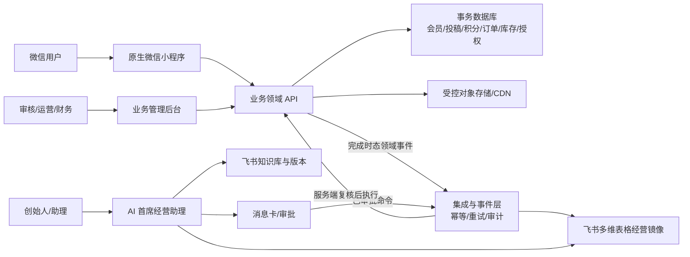

# CISME 消费者小程序与飞书 AI 经营中台整合产品需求文档（PRD）

会员 · 护理 · UGC · 外部任务 · 积分 · 分享归因 · 商城 · 飞书 AI 经营闭环

**版本：**V2.0 · 整合评审版

**日期：**2026-08-13

**需求方：**CISME / 熹芃（上海）生物科技有限公司

**产品负责人：**李佳静 / CISME

**评审对象：**创始人 / 产品 / 设计 / 技术 / 测试 / 运营 / 财务 / 法务 / 飞书实施

**文档状态：**待跨职能评审；TBD 未签字前不得进入对应模块开发

**发布范围：**公开项目文档（历史版本，仅供追溯）

> **一句话目标**
>
> 以微信小程序承接消费者护理、内容、会员、积分与交易，以飞书作为两人团队的经营决策、审批、任务与复盘中台；两端通过统一事件、唯一业务编号和审计日志形成可追溯闭环。

整合原则：尽可能保留两份 V1.0 的业务意图；冲突项不并列含糊处理，而是给出唯一生效口径、保留来源和验收方式。

**文档用途：**直接用于产品评审、UI/UX 设计、技术评估、供应商询价、开发排期、测试验收和运营培训；同时可交付飞书实施顾问、Aily 搭建人员、自动化工程师、小程序/后端/后台开发团队。本文定义业务需求与实施边界，不代表所有 TBD 已获批准。

**源文档：**

1. `CISME飞书AI经营助理产品需求说明书_V1.0 .docx`（V1.0，2026-08-11）。
2. `CISME微信小程序会员积分与UGC商城_PRD_V1.0(1).docx`（V1.0 开发评审版，2026-08-10）。

复核基线 SHA-256：

- 飞书源文档：`8f605147156e9683c5e135239c4ce57dac9ed9f70a269421d2bd360264d332ba`
- 微信小程序源文档：`720ad3e8ef03de27c79a931e2d39e05ff04b0746f7201196b8ad82338770a2d4`

## 目录

| **章节** | **内容**                           |
|----------|------------------------------------|
| 0        | 程序员先读：整合结论与生效规则     |
| 1        | 项目背景、战略与指标               |
| 2        | 范围、分期与非目标                 |
| 3        | 用户、角色、权限与治理             |
| 4        | 双系统总体架构与主数据边界         |
| 5        | 端到端核心业务流程                 |
| 6        | 微信小程序产品需求                 |
| 7        | 积分、会员与授权规则               |
| 8        | 商城、订单、库存与归因             |
| 9        | 飞书 AI 经营中台需求               |
| 10       | 统一数据模型、事件与接口           |
| 11       | 风控、合规、安全与隐私             |
| 12       | 消息、埋点与经营数据口径           |
| 13       | 非功能需求                         |
| 14       | 实施计划、成本与交付物             |
| 15       | 测试、验收与上线门槛               |
| 16       | 开发前 TBD 决策                    |
| 附录     | 状态机、错误码、追踪矩阵、阈值、评审、AI 总控基线、官方资料与复核结果 |

## 0. 程序员先读：整合结论与生效规则

> **产品结论**
>
> 本项目不是一个聊天机器人，也不是一个孤立商城。它是由消费者小程序、业务后端/管理后台、飞书 AI 经营中台组成的三层系统：消费者端完成护理、内容、积分和交易；业务后端持有会员、投稿、积分、订单、库存、授权等交易事实；飞书读取授权范围内的事实，完成经营建议、任务、审批、预警与复盘。

- 微信小程序/业务后端是会员、积分、订单、库存、投稿、授权与归因的权威主数据源；飞书不得直接改账本或订单事实。

- 飞书是创始人与助理的唯一内部工作入口；多维表格是 MVP 经营镜像与协作数据层，不应在交易规模增长后替代专用交易数据库。

- AI 可分类、计算、检索、生成草稿、建议、提醒和写入非关键状态；不得自动发布、改价、追加预算/投流、采购、退款、承诺功效或诊断疾病。

- 站内 UGC 与外部社交投稿是两条独立内容通路：前者用于社区展示，后者用于任务领奖；审核、授权、编号和积分规则不得混用。

- 所有奖励与扣减都通过积分流水发生；页面余额只由流水聚合，不允许直接修改余额或同时把同一笔奖励计入待审与冻结。

- 所有关键参数均后台配置并版本化；本文的阈值、积分和价格为初始建议或内部验证线，不是永久硬编码。

### 0.1 冲突修正与唯一生效口径

| **冲突/错误** | **V2.0 生效口径** | **原因** |
|----|----|----|
| 飞书 7 天 MVP vs 小程序 12 周上线 | 双轨推进：7 天只做飞书受控试点；小程序生产 V1 按 12–16 周，双系统灰度约 16–20 周 | 避免把低代码试点等同生产交付 |
| 多维表格被称为业务数据库 | 飞书 MVP 可作为经营镜像/协作数据层；交易事实由后端事务库持有 | 积分、库存、支付退款需要强一致和审计 |
| UGC 发布即公开 | 站内内容默认先审后发；DRAFT→SUBMITTED→APPROVED→PUBLISHED | 符合原 PRD 的人工审核和内容治理 |
| 投稿通过后待审→可用/冻结描述含糊 | 提交=pending；审核通过后按规则进入 frozen 或 available；同一奖励只处于一个状态 | 消除双计和财务口径歧义 |
| 固定 submission_id/share_id | 每次领取/分享服务端生成唯一编号；重复请求按幂等键返回原记录 | 支持去重、申诉、归因和审计 |
| 事件名 task_claim/claim 等两套命名 | 统一使用完成时态事件字典，如 submission_claimed、payment_succeeded | 跨系统对账与重放需要单一语义 |
| 飞书数据表与 TBD 决策都使用 T01–T14 | 飞书表统一命名 `FS-T01`–`FS-T14`；开发决策统一命名 `TBD-01`–`TBD-14`，追踪矩阵保留源编号 | 避免接口、工单、测试与会议纪要引用歧义 |
| 飞书预算阈值一处写“80%–110% 黄色、>110% 红色”，另一处写“80% 提示、100% 黄色、110% 红色” | 80% 提示、100% 黄色、≥110% 红色并暂停非必要支出 | 采用源文档更细、且被公式/WF/TC 三处共同支持的口径 |
| 现金佣金与积分增长混用风险 | 一期仅积分；现金佣金另建合同、税务、结算、追缴与提现系统 | 合规与财务边界不同 |
| 598 成交被统称转化 | 曝光、访问、注册、加购、订单、支付、签收、有效成交、退款逐层统计 | 经营判断必须可解释 |

### 0.2 需求等级

| **标记** | **含义**     | **处理**                 |
|----------|--------------|--------------------------|
| MUST     | 一期上线必需 | 未完成不能上线           |
| SHOULD   | 一期优先     | 降级必须评审并保留扩展位 |
| PHASE 2  | 二期能力     | 一期保留数据结构/接口    |
| TBD      | 待业务确认   | 对应负责人在开发前签字   |

### 0.3 修订记录

| **版本** | **日期** | **文档/负责人** | **变更摘要** |
|---|---|---|---|
| V1.0 | 2026-08-10 | 微信小程序 PRD / CISME | 首次形成会员、积分、UGC、商城、公众号、归因、后台与验收基线 |
| V1.0 | 2026-08-11 | 飞书 AI 经营助理 PRD / CISME | 首次形成一个入口、七类专业能力、飞书表/工作流、审批、知识与验收基线 |
| V2.0 | 2026-08-13 | 整合 PRD / CISME | 合并双系统；修正主数据、积分双计、状态机、排期等冲突；补齐社区评论、跨系统事件、成本与生产门槛 |

## 1. 项目背景、战略与指标

CISME 处于新品冷启动阶段，核心团队为创始人和一名助理。品牌希望以微信公众号与微信小程序沉淀会员，通过真实护理记录、站内 UGC、外部社交任务、积分与分享归因，把购买客户逐步转化为记录者、分享者、成交贡献者与复购会员；同时用飞书 AI 经营中台补足内容策划、用户研究、数据分析、竞品情报、项目供应链、经营预警与合规初审能力。

### 1.1 业务基础

| **项目** | **定义** |
|----|----|
| 品牌 | CISME，高端头皮护理品牌，以科学护肤方式养护头皮 |
| 核心表达 | 你的皮肤每天都要护理，为什么头皮不是？ |
| 产品逻辑 | 00 周期净澈、01 日常头皮清洁、02 发丝水光修护、03 洗后头皮精护 |
| 核心人群 | 25–40 岁都市女性，具备科学护肤认知、消费能力与生活方式表达能力 |
| 核心商业验证 | 598 元正装周期套组的有效支付、退款、签收、复购与获客成本 |
| 体验链路 | 19.9/99/199 元体验机制用于筛选或验证，不替代 598 元核心成交 |
| 渠道 | 小红书等外部平台为冷启动内容阵地；微信承接会员交易；飞书承接内部经营 |

### 1.2 北极星与经营指标

| **层级** | **指标** | **定义/公式** | **用途** |
|----|----|----|----|
| 北极星 | 598 元套组有效支付人数 | 支付成功且超过退款/冻结判定节点的去重人数 | 验证真实成交 |
| 核心 | 购买者→分享者转化率 | 至少 1 单已完成用户中，至少 1 条内容审核通过人数/已购人数 | 验证增长闭环 |
| 核心 | 分享成交率 | 分享归因有效支付人数/分享落地访问人数 | 验证内容效率 |
| 效率 | 598 元有效支付 CAC | 对应活动全部可归因成本/598 元有效支付人数 | 验证获客与支付效率 |
| 效率 | 598 元有效签收 CAC | 归属内容、测试员与投流成本/598 元有效签收人数 | 验证售后后获客效率 |
| 质量 | 有效内容率 | 审核通过且保留期达标内容数/提交内容数 | 控制刷帖 |
| 经营 | 积分成本率 | 已核销积分对应成本/有效成交额 | 财务预警 |
| 利润 | 首单贡献利润 | 实收−产品−履约−平台−售后−营销成本 | 判断可持续性 |
| 供应 | 库存可售天数 | 可用库存/近 7 天平均实际签收量 | 采购预警 |

补充经营口径（均需按统一日期、渠道与退款口径计算）：

| **指标** | **公式/定义** |
|---|---|
| 支付转化率 | 支付人数 ÷ 商品访问人数 |
| 签收 CAC | 归属营销成本 ÷ 实际签收人数 |
| 预算预警 | 80% 提示、100% 黄色、110% 红色并暂停非必要支出 |
| 13 周现金流 | 回款、退款、供应链、工资、投流、软件、积分负债、税费逐周预测 |

### 1.3 一期成功标准

消费者小程序与业务后台成功标准：

- 用户可完成微信登录、按需手机号绑定、会员建档，并正确识别公众号关联身份。
- 运营可创建任务；用户可提交外部内容或发布站内 UGC；审核通过后自动形成唯一积分流水。
- 用户可查看可用、待审、冻结、已用、失效和欠分，并在商城兑换或按 SKU 规则抵扣。
- 每位会员有唯一邀请码；每次分享有唯一 `share_id` 和小程序码，可追踪访问、注册、加购、订单、支付与退款。
- 退款或异常时自动撤回对应冻结奖励；已解冻积分不足时形成欠分和限制兑换状态，不得静默丢失。
- 后台具备用户、任务、审核、内容、积分、商城、订单、归因、风控、消息、权限、日志和数据看板。

飞书 AI 经营中台成功标准：

| **编号** | **成功标准** | **验收方式** |
|---|---|---|
| S1 | 创始人只面对一个 AI 入口 | 使用 10 类真实指令进行意图路由测试 |
| S2 | 系统能把创始人决定转为助理任务 | 审批通过后自动写入任务表并通知助理 |
| S3 | 常规内容周更、热点按需触发 | 周度批处理与 A 级热点应急流程互不冲突 |
| S4 | 关键数据可追溯 | 内容、测试员、用户、订单、预算均有唯一编号和来源 |
| S5 | AI 不能越权 | 价格、预算、投流、功效、采购等动作必须等待审批 |
| S6 | 异常能被发现 | 预算、退款、投诉、库存、合规、逾期六类预警各有测试通过 |

## 2. 范围、分期与非目标

### 2.1 产品范围

| **系统** | **一期 MUST** | **二期/明确排除** |
|----|----|----|
| 微信消费者端 | 微信身份、会员、护理、任务、外部投稿、站内 UGC、积分、邀请、商城、订单售后、消息、授权 | 站内视频流、复杂 CDP、多触点现金分佣 |
| 业务后台 | 会员、任务、审核、积分账本、内容、商品库存、订单售后、归因、风控、RBAC、日志、紧急开关 | 无人审核、AI 盗图模型、多仓复杂调拨 |
| 飞书经营中台 | 单一 AI 入口、核心数据表、今日任务、晚间复盘、审批、预警、选题、知识库、审计 | 自动发布、自动改价/投流/采购、复杂多模型编排 |
| 集成 | 小程序事件入飞书、支付/退款/库存/积分对账、授权范围内通知 | 抓取非公开平台数据、未授权群发营销 |

### 2.2 分阶段退出条件

| **阶段** | **周期** | **范围** | **退出条件** |
|----|----|----|----|
| G0 需求冻结 | 2 周 | 状态机、规则、事件、接口、隐私文本、技术尖峰 | PRD/TBD 签字，原型与架构通过 |
| 飞书 MVP | 7 天受控试点 | 10–14 张核心表、单入口、今日/晚间、审批、基础预警 | 两人团队用真实样本运行一周；不等于生产上线 |
| 小程序 V1 | 12–16 周 | 消费者端、后端、后台、账本、交易、归因、审核 | 关键闭环联调、P0/P1 清零 |
| 双系统灰度 | 16–20 周 | 事件集成、监控、灾备、权限、审计、运营培训 | 支付—退款—积分追缴全链演练通过 |
| P2 | 业务验证后 | 复杂归因、13 周现金流、更多合法自动化、独立数据平台 | 业务量证明投入必要性 |

## 3. 用户、角色、权限与治理

### 3.1 消费者角色

| **角色** | **进入条件** | **核心权限** | **限制** |
|----|----|----|----|
| 游客 | 未登录 | 浏览公开内容与商品 | 不可发布、领积分、下单 |
| 注册会员 | 微信登录+必要时手机号 | 任务、发布、积分、商城 | 受新人风控 |
| 已购会员 | 绑定有效订单 | 已购任务、兑换权益 | 退款后资格动态调整 |
| 体验官 | 运营活动名单 | 专属任务、阶段记录 | 周期与名额限制 |
| 分享者 | ≥1 条外部内容通过 | 分享数据与成长权益 | 违规可降级 |
| 优质分享者/KOC | 规则或人工评定 | 高级任务、精选、共创 | 现金佣金不在一期 |

### 3.2 内部角色与关键权限

| **角色** | **职责** | **允许** | **禁止/复核** |
|----|----|----|----|
| 创始人 | 品牌、选题、价格、预算、供应链、重大风险决策 | 查看全部；审批关键事项；修改战略规则 | 业务最终责任，不绕过审计 |
| 助理 | 拍摄、发布、互动、测试员、素材和基础数据 | 执行视图；更新任务状态 | 不得改价格、预算、功效、积分价值 |
| 审核员 | 投稿/UGC/评论审核、评分、补件、驳回 | 按授权队列操作 | 不得改全局规则；高额积分升级 |
| 运营管理员 | 任务、内容、商品、用户运营 | 创建/暂停/配置非高危项 | ≥300 分需二次确认；500 分/批量双审 |
| 财务/风控 | 积分成本、订单退款、冻结、异常案件 | 查账、重算、追缴、案件处置 | 内容编辑只读；调整必须留痕 |
| 超级管理员 | 规则、权限、审计、紧急开关 | 技术与系统管理 | 高危操作二次确认；日志不可删除 |
| 飞书实施/系统管理员 | 配置多维表、工作流、Aily、应用权限、日志与故障排查 | 技术配置、监控、恢复与导出 | 不得替代创始人、财务、法务或内容审核的业务审批 |
| AI | 检索、分类、计算、生成、建议、提醒、路由 | 非关键写回与草稿 | 不得发布、改价、投流、采购、退款、功效承诺 |

关键动作决策矩阵：

| **动作** | **AI** | **助理/运营** | **创始人/授权复核人** |
|---|---|---|---|
| 生成草稿、分类、计算、提醒 | 可自动 | 查看、补充、纠错 | 可查看 |
| 内容发布 | 不可自动发布 | 按批准流程执行 | 关键内容审批 |
| 价格/优惠修改 | 只可建议和测算 | 不可修改 | 最终审批 |
| 预算/投流追加 | 只可测算和预警 | 按批准额度执行 | 最终审批 |
| 采购/供应链变更 | 只可预测和生成任务 | 记录进度 | 最终审批 |
| 功效与医研表达 | 初审并检索证据库 | 不得擅改 | 最终审批；必要时法务/专业人员复核 |
| 普通评论回复 | 生成标准回复草稿 | 按社区规则执行 | 无需逐条审批 |
| 投诉/不良反应 | 红灯初筛并上报 | 收集原始资料 | 决定处置并交质量/医疗/法律专业人员 |

### 3.3 一个 AI 总控入口与七类专业能力

| **AI 能力** | **职责** | **典型输出** |
|----|----|----|
| AI 首席经营助理 | 意图路由、结果合并、冲突检查、审批、决策记录 | 今日三项决策、任务卡、总复盘 |
| 热点与选题 | 热点/搜索/竞品内容/评论问题评分与时效判断 | A/B/C 预警、周度选题池 |
| 内容与脚本 | 周度批量脚本；批准后的突发脚本 | 图文、口播、分镜、拍摄单、回复 |
| 用户洞察 | 评论、私信、售后、测试员六层标签 | 需求周报、购买阻力、潜客清单 |
| 经营数据 | 漏斗、CAC、利润、预算、现金流、异常 | 看板、日报、13 周现金流 |
| 竞品与价格 | 价格、套组、促销、差评、建议 | 周度竞品与价格报告 |
| 项目与供应链 | 任务、会议、版本、库存、采购风险 | 进度、库存预警、纪要 |
| 合规风控 | 证据、广告、授权、隐私、投诉初筛 | 发布前检查、红黄绿风险卡 |

## 4. 双系统总体架构与主数据边界

| **层级** | **建议组件** | **职责/权威边界** |
|----|----|----|
| 消费者交互 | 原生微信小程序 + CISME 自定义组件 | 护理、社区、任务、积分、商城、消息；不持有最终业务事实 |
| 业务服务 | 领域 API、事务数据库、对象存储、可靠消息 | 会员、投稿、积分、库存、订单、退款、授权、归因的唯一真相 |
| 运营后台 | Web 管理台 | 任务、审核、内容、积分、商品、订单、风控、权限与日志 |
| 飞书交互 | Aily/机器人、消息卡片、审批 | 创始人唯一内部入口、审批与通知 |
| 飞书数据/流程 | 多维表格、Workflow/自动化 | 经营镜像、任务、选题、预算、库存、决策；不得直接改交易账本 |
| 知识与 AI | 飞书知识库 + Aily/自建 Router + 可批准模型 | 检索当前版本、技能调度、结果合并和置信边界 |
| 集成治理 | 事件总线、Webhook、开放 API、RBAC、审计、监控 | 幂等、数据最小化、重试、回放、备份与恢复 |

> **数据来源边界**
>
> 没有官方接口或经授权数据工具时，不得声称“全平台实时监测”。允许来源包括助理上传、品牌后台导出、公开页面、用户互动、商城/小程序接口及经批准第三方服务；每条热点、竞品、订单和反馈必须记录来源与采集时间。

### 4.1 跨系统同步原则

- 业务后端发布完成时态领域事件；飞书以 event_id/idempotency_key 去重写入经营表。

- 飞书审批产生 command_id；业务后端校验权限、对象版本与状态后执行，再回传成功/失败事件。

- 敏感字段默认不进入飞书；手机号、地址、支付标识仅传脱敏值或业务编号。

- 同步失败进入重试与人工队列；任何重放不得重复发分、重复扣库存、重复建任务或重复通知。

- 外部网页、平台规则和市场价格具有时效性，必须保留采集日期；重大经营、价格、合规与供应链决策必须人工复核。

- 数据入口强制必填、唯一编号、枚举、跨表 ID 关联、异常值提示和来源字段；关键动作保留触发、输入、知识/模型版本、输出、写回、审批、人工修改、失败与重试日志。

## 5. 端到端核心业务流程

### 5.1 注册、身份与会员建档

1.  用户从公众号菜单、分享卡片、小程序码或搜索进入；保留 source/share_id/campaign。

2.  微信登录换取会话标识；浏览公开内容不强迫手机号授权，使用会员/交易能力时按需请求。

3.  服务端优先以 UnionID 合并；无 UnionID 时以 OpenID+AppID 维持渠道账户，禁止猜测合并。

4.  用户协议、隐私政策为基础服务必要确认；营销订阅和可选授权独立选择。

5.  幂等创建 member、points_account、邀请关系与来源记录；注册/资料奖励仅发一次。

### 5.2 外部社交内容领奖

6.  运营创建版本化任务，定义平台、时间、资格、名额、素材、披露、基础/质量分、上限、冻结和保留期。

7.  用户领取；服务端原子扣减名额并生成 submission_id。重复领取返回同一有效投稿，不新建记录。

8.  用户保存草稿并上传原始素材、发布截图、链接、平台账号、利益关系披露和分层授权。

9.  系统校验必填、文件类型/大小、链接合法性与唯一性、文件哈希、频控、平台/发布时间、任务有效期。

10. 审核员按 100 分量表执行通过、补件、驳回或风险复核；所有操作记录原因、证据、SLA 和前后状态。

11. 提交时只生成 pending_points；审核通过后按规则进入 frozen_points 或 available_points。

12. 保留期内删除/隐藏、重复或违规时关联原流水冻结/撤回；用户在期限内补件或申诉，沿用同一 submission_id。

### 5.3 站内 UGC

13. 会员创建 1–9 图内容，填写标题、正文、产品、护理阶段、使用天数、标签、公开范围与授权。

14. 草稿本地/服务端恢复；提交后进入 SUBMITTED，先进行敏感词、重复素材和风险初筛。

15. 人工审核通过后进入 APPROVED，再发布为 PUBLISHED；驳回/待修改说明具体原因。

16. 公开流支持推荐、最新、四部曲、真实体验、精选、关注；互动支持点赞、收藏、评论、举报、屏蔽。

17. 评论同样进入审核/风控；作者可删除本人内容，平台下架和授权撤回分别处理并保留证据。

### 5.4 护理记录与成长

18. 用户按 00–03 四部曲完成护理记录，保存时间、步骤、自评与非医疗提示。

19. 完成事件幂等发放配置积分；同日重复提交不重复奖励。

20. 护理记录可转为站内 UGC 草稿，但不自动公开；用户补充公开范围与授权后提交审核。

21. 等级由有效购买、合格内容、质量、连续记录、有效邀请/支付、退款率与违规共同计算。

### 5.5 分享、订单、退款与奖励

22. 每次分享生成 share_id；访问、注册、加购、订单、支付和退款同时记录 first_touch 与 last_touch。

23. 结算预览由服务端签名；创建订单时原子预占库存与积分，保存 SKU、价格、券、运费、积分和归因快照。

24. 微信支付回调验签且幂等；成交奖励先冻结，确认收货并超过售后节点后解冻。

25. 支付失败/取消释放库存与积分；重复回调、定时补偿和人工重放不得重复核销或奖励。

26. 全额退款撤回全部对应奖励；部分退款按有效支付比例重算；抵扣积分按原批次回退。

27. 若已用奖励无法完全撤回，形成 debt_points 并限制兑换，后续所得优先冲抵。

### 5.6 飞书经营闭环

28. 每日 09:00 汇总任务、热点、预算、供应链与风险，只向创始人突出最多 3 项必须决策。

29. 创始人在卡片审批；通过后生成负责人、截止、完成标准、预算、来源和风险完整的执行任务。

30. 热点 09:00/14:00/20:00 扫描；普通选题进入周度池，只有 A 级且经批准才生成紧急脚本。

31. 21:30 生成晚间复盘；周日生成经营周报和“停止做什么”清单。

32. 新决定替代旧决定时，标记被替代版本并同步受影响页面、话术、规则、任务和知识版本。

## 6. 微信小程序产品需求

### 6.1 信息架构与页面清单

| **ID** | **页面** | **主要模块** | **权限** | **验收重点** |
|----|----|----|----|----|
| P01 | 护理首页 | 当日护理、自评、积分/等级、核心任务、精选内容、商城和邀请的动态入口 | 游客/会员 | 入口按角色与状态展示，核心行为突出且不堆叠 |
| P02 | 登录注册 | 微信身份、手机号、协议、来源恢复 | 游客 | 拒绝手机号仍可浏览 |
| P03 | 任务中心 | 可参与/进行中/已完成/失效 | 会员 | 角色、名额、时效过滤 |
| P04 | 任务详情 | 规则、要求、披露、积分、截止、领取 | 会员 | 领取前确认规则版本 |
| P05 | 外部投稿 | 草稿、原图、截图、链接、账号、授权 | 会员 | 上传恢复、重复检测 |
| P06 | 审核进度 | 时间线、原因、补件、申诉、积分 | 投稿人 | 状态与 SLA 准确 |
| P07 | 护理社区 | 推荐/关注/最新/精选/四部曲/体验 | 公开 | 游客只读；频道真过滤 |
| P08 | 发布内容 | 1–9 图、标题、正文、产品、阶段、标签、公开/授权 | 会员 | 先审后发与草稿恢复 |
| P09 | 内容详情 | 轮播、作者、互动、评论、举报、任务桥接 | 公开/会员 | 状态一致、隐私/删除正确 |
| P10 | 公开个人主页 | 白名单资料、内容、勋章、等级 | 公开 | 可隐藏，缓存及时失效 |
| P11 | 成长中心 | 等级、进度、权益、规则 | 会员 | 动态计算，不重复叠加倍率 |
| P12 | 我的积分 | 各余额、流水、到期、欠分 | 本人 | 来源/状态筛选，余额与流水一致 |
| P13 | 邀请分享 | 邀请码、小程序码、素材、规则 | 分享者 | 每次生成 share_id |
| P14 | 分享数据 | 访问、注册、支付、退款、有效成交 | 分享者 | 仅本人，首末触口径可切 |
| P15 | 商城首页 | 分类、搜索、现金/积分商品 | 公开 | 价格库存实时 |
| P16 | 商品详情 | SKU、库存、价格、积分、售后 | 公开 | 显示抵扣上限与模式 |
| P17 | 结算 | 地址、券、积分、运费、支付 | 会员 | 服务端预览，积分二次确认 |
| P18 | 订单与售后 | 订单、物流、取消、退款、兑换 | 本人 | 状态与积分/库存联动 |
| P19 | 消息中心 | 审核、积分、订单、到期、活动 | 会员 | 已读状态与真实事件守卫 |
| P20 | 设置与协议 | 隐私、授权、数据、注销、客服申诉 | 会员 | 可撤回可选授权 |
| P21 | 会员中心 | 个人资产、订单、内容、任务、商城入口 | 会员 | 与公开主页严格分离 |
| P22 | 我的内容 | 草稿/审核/已发布/驳回/私密/收藏 | 本人 | 状态筛选与处理入口 |
| P23 | 护理记录 | 日历、连续记录、趋势、分享草稿 | 本人 | 非医疗表达、历史真实 |

### 6.2 社区与评论功能

- 推荐/关注/最新必须使用不同排序与数据源；无关注时给出发现作者和关注引导，不伪造关注内容。

- 搜索覆盖内容、作者与标签；支持最近搜索、清空、无结果、取消和结果数量。

- 列表与详情共享 Post/Reaction/Follow/Collection 状态；赞、藏、关注和评论计数实时一致。

- 评论支持发布、回复、@语义、点赞、删除本人评论、举报他人评论、输入校验、失败重试与空态。

- 举报原因、屏蔽、不感兴趣、作者删除、审核下架均产生案件/日志；前端立即反馈并可撤销非破坏操作。

- 内容示例覆盖真实使用、阶段记录、中性/负面体验、护理方法、空瓶记录与利益披露，不以正面结论作为发分条件。

### 6.3 交互、视觉与无障碍

- 保持 CISME 高级简约、紫白珍珠、苹果式毛玻璃视觉；不整体套用第三方 UI 皮肤。

- 逻辑目标以 iPhone 393×852 为基线，并验证 Pixel 427×952、键盘开闭、安全区和横竖内容溢出。

- 主要触控目标至少 44×44 CSS px；正文/元数据可读，对比度不依赖低对比浅灰。

- 底部导航支持轻点与横向拖动；拖拽阈值、Pointer Capture、取消回弹和缩放坐标正确。

- 控件提供焦点、ARIA pressed/selected/current、错误说明；减少动效设置同时控制 CSS 与 JS 动画。

- 图片使用合适尺寸、WebP/AVIF、懒加载、替代文本；弱网显示占位、失败和重试。

- 站内发布支持 1–9 图；一期视频只作为外部投稿附件，不建设站内视频流。库存低于 SKU 阈值时后台预警，缺货 SKU 禁止继续兑换或下单。

### 6.4 内容任务配置字段

任务发布后必须生成不可变的规则版本；进行中的投稿继续引用领取时版本，运营修改仅对新领取生效。不得直接覆盖已经产生财务影响的规则。

| **字段组** | **字段** |
|---|---|
| 基础 | 任务 ID、名称、状态、活动、适用角色、名额、开始/结束时间 |
| 平台 | 站内、朋友圈、小红书、抖音、视频号、微博、Instagram、其他 |
| 要求 | 主题、图片数、视频时长、必填标签、必须项、禁止项、示例、保留期 |
| 激励 | 基础分、质量分档、奖励上限、是否冻结、解冻日期/规则、预算池 |
| 合规 | 利益关系披露提示、功效表达提示、授权选项、隐私提示 |
| 审核 | 审核 SLA、审核组、是否双审、驳回原因模板、补件期限 |
| 风控 | 每人次数、月上限、链接唯一、素材哈希、设备/地址关联规则 |

### 6.5 内容状态与允许操作

V1.0 源文档把外部投稿与站内 UGC 状态放在同一张表中。V2.0 保留全部状态语义，但在实现中拆成两个聚合：`submission` 负责外部任务，`ugc_post` 负责站内内容；`PUBLISHED` 只适用于站内公开内容。状态迁移必须由服务端校验，不得由前端直接指定终态。

| **状态码** | **中文状态** | **适用对象** | **用户操作** | **后台操作** |
|---|---|---|---|---|
| DRAFT | 草稿 | 两者 | 编辑、删除 | 不进入审核队列 |
| SUBMITTED | 已提交 | 两者 | 审核前撤回 | 必填、重复、频控与风险初筛 |
| NEED_INFO | 待补充 | 两者 | 在期限内补材料 | 填写原因、材料项与截止日 |
| RISK_REVIEW | 风险复核 | 两者 | 查看进度、补充证据 | 风控审核、冻结证据 |
| APPROVED | 已通过 | 两者 | 外部投稿查看积分；站内内容等待发布 | 发分/设保留期；或进入站内发布 |
| REJECTED | 未通过 | 两者 | 申诉或按规则重提 | 填写标准原因和证据 |
| PUBLISHED | 站内已发布 | 仅 `ugc_post` | 编辑申请、删除/设为私密 | 社区可见、互动治理 |
| WITHDRAWN | 已撤回/删除 | 两者 | 按规则申诉 | 撤回积分或归档；保留审计证据 |

外部投稿主状态机：`DRAFT → SUBMITTED → NEED_INFO/RISK_REVIEW/APPROVED/REJECTED/WITHDRAWN`。站内内容主状态机：`DRAFT → SUBMITTED → NEED_INFO/RISK_REVIEW/APPROVED → PUBLISHED → WITHDRAWN`。任何补件与申诉都沿用原对象 ID，禁止通过新建对象规避重复检测。

### 6.6 业务后台管理需求

| **模块** | **能力** | **关键要求** |
|---|---|---|
| 用户中心 | 查询、标签、等级、订单、积分、风险、授权 | 导出需专项权限；敏感字段脱敏 |
| 任务中心 | 创建、复制、发布、暂停、名额、规则、模板 | 发布后关键奖励规则变更必须版本化 |
| 审核工作台 | 队列、评分、补件、驳回、双审、SLA | 高额积分和风险内容自动升级 |
| 内容中心 | 社区、评论、举报、精选、删除、授权 | 保留原始内容与全部处置证据 |
| 积分中心 | 规则、流水、冻结、失效、手工调整、成本 | 手工调整必须原因、审批、幂等和审计 |
| 商品库存 | SPU/SKU、价格、积分模式、库存、预警 | 历史订单快照不得随配置变化 |
| 订单售后 | 支付、履约、物流、退款、兑换、核销 | 与库存、抵扣积分、奖励积分原子联动 |
| 分享归因 | 渠道、活动、触点、订单、退款、排行 | 可切首次/末次口径；明细可追溯 |
| 风控中心 | 频控、重复、异常订单、冻结、申诉 | 规则命中可解释；证据不可被普通管理员删除 |
| 消息中心 | 模板、订阅触点、发送记录、失败重试 | 不得超越微信授权范围营销 |
| 权限审计 | RBAC、审批、操作日志、紧急开关 | 高危操作二次确认；日志不可篡改 |
| 数据看板 | 核心漏斗、内容、积分、商城、财务预警 | 支持筛选、导出和口径版本展示 |

### 6.7 外部社交任务的入口与推荐引流闭环

外部领奖是增长主链路，但不应把社区发布表单做成混合表单。界面保持一个统一创作心智、两条明确通路：

| **入口** | **展示方式** | **进入页面/动作** | **目的** |
|---|---|---|---|
| P01 护理首页 | “分享真实体验，领取积分”动态任务卡；显示可领取、进行中或待补件状态 | P03 任务中心或直接进入当前 P04 | 首要推荐引流入口，依据资格动态展示 |
| P07 社区 | 右上角创作按钮打开两项毛玻璃操作单：“发布社区作品”“完成外部平台任务” | 前者 P08；后者 P03/P04 | 创作入口统一，业务对象严格分离 |
| P09 内容详情 | 本人内容且符合活动时展示“参与外部分享任务”桥接卡 | 先领取任务并生成新 submission_id | 复用创作动机，不自动把站内内容当外部领奖凭证 |
| P21 会员中心 | 我的任务、审核进度、待补件、待解冻摘要 | P03/P06/P12 | 找回进行中任务，降低流失 |
| 订阅消息/服务通知 | 领取临期、补件临期、审核结果、解冻提醒 | 对应 P04/P05/P06/P12 | 仅在用户授权与微信能力范围内触达 |

入口状态守卫：游客可查看任务摘要，领取时按需登录；不符合资格、名额已满、活动失效必须明确说明；领取成功由服务端生成唯一 `submission_id` 并立即进入 P05；草稿、补件、申诉继续复用同一 ID。任务卡不得承诺必得固定积分，应显示基础规则、质量区间、频控、保留期和可能撤回条件。

## 7. 积分、会员与授权规则

### 7.1 积分账户口径

| **字段**         | **含义**                   | **可消费**           |
|------------------|----------------------------|----------------------|
| pending_points   | 行为已提交、尚未审核       | 否                   |
| frozen_points    | 已批准但未过保留期/售后期  | 否                   |
| available_points | 审核与冻结期完成           | 是                   |
| used_points      | 历史已核销                 | 否                   |
| expired_points   | 到期失效                   | 否                   |
| debt_points      | 退款/违规追缴产生的欠分    | 否；后续所得优先冲抵 |
| lifetime_earned  | 历史累计获得，不因使用减少 | 展示用               |

### 7.2 积分状态机

| **当前** | **事件**     | **下一状态** | **系统动作**                     |
|----------|--------------|--------------|----------------------------------|
| 待审核   | 审核通过     | 冻结/可用    | 按版本化规则生成一条奖励流水     |
| 待审核   | 驳回/撤回    | 拒绝/撤回    | 记录原因，不改变可用余额         |
| 冻结     | 到期且无风险 | 可用         | 定时解冻，幂等                   |
| 冻结     | 退款/违规    | 撤回         | 冲销原流水                       |
| 可用     | 抵扣/兑换    | 已使用       | FEFO 扣减具体批次                |
| 可用     | 到期         | 已失效       | 提醒并生成失效流水               |
| 已使用   | 订单退款     | 退回/重算    | 按原批次回退；奖励不足形成欠分   |
| 任意     | 管理员纠错   | 调整         | 原因、权限、审批、前后值和幂等键 |

> **财务硬规则**
>
> 任何积分变化都必须有 `points_ledger` 与 `idempotency_key`。不得直接设置余额；不得把同一笔奖励同时显示为 `pending` 与 `frozen`；退款、违规和管理员纠错都必须通过反向流水或调整流水完成。

### 7.3 积分使用规则

- SKU 可配置纯积分兑换、积分+现金、积分抵扣三种模式；同一 SKU 只能按当前有效规则结算。
- 核心正装默认设置积分抵扣上限；积分价值、比例和毛利红线由财务与创始人审批，本文不预设最终数值。
- 消耗按先到期先使用（FEFO）；订单取消或退款按原批次退回。原批次已到期时，可按批准规则给予短期恢复有效期，并留下规则版本。
- 积分有效期、到期提醒节点、单笔抵扣比例、单日/单月使用上限均由后台版本化配置。
- 积分不可转赠、不可提现，前端不得使用“等同现金”“账户余额可提现”等误导表述。
- 下单时预占具体积分批次；支付失败、取消或超时幂等释放；支付成功后正式核销，释放任务与支付回调必须互斥。

### 7.4 初始积分规则（全部可配置）

| **行为** | **积分** | **审核** | **频控** | **条件** |
|----|----|----|----|----|
| 注册+手机号 | 20 | 自动 | 每人 1 次 | 身份唯一 |
| 完善资料 | 10 | 自动 | 每人 1 次 | 字段完整 |
| 首次绑定有效订单 | 50 | 自动/人工 | 每人 1 次 | 订单唯一 |
| 每日签到 | 10 | 自动 | 每日 1 次 | 月上限 TBD |
| 站内合格图文 | 20–50 | 人工 | 每日 1/每周 3 次计分 | 原创合规 |
| D1 体验反馈 | 30 | 人工 | 每活动 1 次 | 任务字段完整 |
| D7 体验反馈 | 50 | 人工 | 每活动 1 次 | 任务字段完整 |
| D14 体验反馈 | 80 | 人工 | 每活动 1 次 | 任务字段完整 |
| D28 完整报告 | 150 | 人工 | 每活动 1 次 | 含阶段记录 |
| 朋友圈内容 | 30–80 | 人工 | 每周 1 次 | 截图+账号+披露 |
| 小红书图文 | 100–300 | 人工 | 每内容 1 次 | 链接+截图+原图 |
| 抖音/视频号 | 150–400 | 人工 | 每内容 1 次 | 链接+截图+原视频 |
| 官方精选 | 100 | 人工 | 每内容 1 次 | 可叠加但单独流水 |
| 官方传播授权 | 100–300 | 人工+授权 | 每内容/范围 1 次 | 单独授权记录 |
| 邀请注册 | 30 | 自动 | 月上限 TBD | 反作弊通过 |
| 邀请有效支付 | 100–500 | 自动+冻结 | 每订单 1 次 | 售后期解冻 |
| 建议/问卷 | 20–100 | 人工/自动 | 按活动 | 不可重复 |
| 月度优质分享者 | 300–500 | 人工双审 | 每月 1 次 | 审批 |

### 7.5 内容质量评分

| **维度**       | **分值** | **审核要点**                        |
|----------------|----------|-------------------------------------|
| 真实性与原创性 | 25       | 原始素材、个人表达、无盗用/批量模板 |
| 真实使用场景   | 20       | 可见护理行为，不强制品牌露出        |
| 视觉质量       | 15       | 清晰、主体明确、无严重遮挡          |
| 体验完整度     | 15       | 阶段、感受或变化；允许中性/负面     |
| 任务符合度     | 10       | 平台、数量、话题、时限              |
| 参考价值       | 10       | 对目标用户有信息/生活方式价值       |
| 利益关系披露   | 5        | 体验、赠品、积分关系按提示披露      |

| **总分** | **审核结果** | **建议积分** |
|---|---|---|
| <60 | 驳回或补充材料 | 0 |
| 60–69 | 合格 | 10–30 |
| 70–79 | 良好 | 50–100 |
| 80–89 | 优质 | 100–300 |
| 90–100 | 精选候选 | 300–500 |

实际奖励受任务基础分、上限、频控、预算与人工复核约束。积分奖励“真实完成与内容质量”，不得以好评、指定正面结论或删除负面评价作为发分条件。

### 7.6 会员等级与公开资料

| **等级**        | **建议进入条件**     | **核心权益**                 |
|-----------------|----------------------|------------------------------|
| L1 普通会员     | 注册完成             | 基础任务、商城               |
| L2 已购会员     | 有效完成订单         | 已购任务、兑换               |
| L3 体验记录者   | ≥1 条站内记录通过    | 记录勋章、阶段任务           |
| L4 品牌分享者   | ≥1 条外部内容通过    | 分享数据、邀请任务           |
| L5 优质分享者   | 质量/成交/低退款达标 | 高级任务、精选、指定行为倍率 |
| L6 创始会员/KOC | 人工邀请或综合规则   | 专属编号、共创、新品资格     |

等级由有效购买、合格内容数、质量分、连续记录、有效注册、有效支付、退款率和违规次数共同计算。积分倍率只作用于后台明确指定的行为；多个等级、活动和身份倍率默认不叠加，确需叠加时必须有上限、规则版本和财务审批。

| **公开字段** | **私密字段** |
|----|----|
| 头像、昵称、简介、护理标签、加入时间、公开内容、精选次数、记录天数、等级、勋章 | 手机号、地址、订单、积分余额、违规记录、审核备注、归因收益明细 |

### 7.7 授权分层

| **授权项**          | **默认**   | **要求**                             |
|---------------------|------------|--------------------------------------|
| 社区公开展示        | 发布时选择 | 站内公开必要；可改为仅自己/删除      |
| 品牌转载公众号/社媒 | 关闭       | 独立勾选；记录范围、版本、时间和撤回 |
| 电商详情页使用      | 关闭       | 独立确认，不由“品牌转载”推定         |
| 商业广告/付费投放   | 关闭       | 独立确认，不与发积分捆绑；明确期限   |
| 保留原始素材        | 按隐私政策 | 明确用途、期限、存储、删除机制       |
| 营销订阅            | 关闭       | 不与基础服务捆绑；记录微信授权结果   |

> **删除与撤回**
>
> 删除社区展示不自动撤回既有品牌授权；撤回授权也不自动删除用户自己的社区内容。两者必须分别操作、分别记录、分别通知运营处理，并受已实际使用内容的合同与法律边界约束。

## 8. 商城、订单、库存与归因

### 8.1 首期商品与结算模式

| **商品/权益**                  | **参考价** | **结算模式**     | **备注**         |
|--------------------------------|------------|------------------|------------------|
| 598 元日常护理套组             | 598        | 现金/积分抵扣    | 核心成交 SKU     |
| 199 元体验旅行套装             | 199        | 现金/积分抵扣    | 体验入口         |
| 洗护补充装                     | 228        | 现金/积分抵扣    | 组合后台维护     |
| 头皮精华                       | 398        | 现金/积分抵扣    | 规格后台维护     |
| 深度清洁补充装                 | 128        | 现金/积分抵扣    | 规格后台维护     |
| 洗漱包/梳/起泡器/干发帽/帆布包 | TBD        | 纯积分/积分+现金 | 限量与库存预警   |
| 优惠券/活动资格                | TBD        | 纯积分           | 有效期与核销规则 |

### 8.2 订单状态机

| **状态**               | **进入条件**      | **允许操作/系统动作**          |
|------------------------|-------------------|--------------------------------|
| PENDING_PAYMENT        | 订单创建          | 支付/取消/超时；库存与积分预占 |
| PAID                   | 支付成功          | 按履约规则申请取消；奖励冻结   |
| FULFILLING             | 进入履约          | 查看物流/售后                  |
| SHIPPED                | 已发货            | 确认收货/售后                  |
| COMPLETED              | 确认收货/自动完成 | 评价/复购；到节点解冻奖励      |
| CANCELLED              | 未支付取消/关闭   | 释放库存与积分                 |
| AFTERSALE              | 售后中            | 冻结相关奖励，等待结果         |
| REFUNDED/PART_REFUNDED | 退款完成          | 积分回退、奖励撤回/重算        |

### 8.3 归因规则

| **项目** | **默认**                     | **配置**                         |
|----------|------------------------------|----------------------------------|
| 归因窗口 | 首次有效访问后 30 天         | 1–90 天                          |
| 注册奖励 | 首次有效邀请关系，默认不覆盖 | 是否允许覆盖                     |
| 成交展示 | 同时记录 first/last touch    | 报表口径切换                     |
| 成交积分 | 末次有效触点                 | 可切首次/末次；同订单只奖励 1 人 |
| 自然复购 | 无有效窗口不归因             | 复购窗口 TBD                     |
| 退款     | 按有效支付金额重算           | 全退撤回、部分退比例撤回         |

- 下单预占库存；超时未支付释放，支付回调与释放任务互斥。

- 积分在提交订单时预占，支付失败/取消释放，支付成功正式核销；抵扣批次按 FEFO 执行。

- 订单保存价格、积分比例、优惠券、运费、SKU 和归因快照；后台修改不影响历史。

- 订单奖励唯一键：reward_type + order_id + beneficiary_member_id。

- 实物兑换订单同样进入地址、库存、履约、物流与售后流程。

## 9. 飞书 AI 经营中台需求

### 9.1 AI 首席经营助理

- 识别意图并路由一个或多个专业能力；无法判断时只追问一个必要问题。

- 合并结果、消除重复、展示分歧、依据、更新时间、假设、风险与置信边界。

- 每天只突出最多 3 项创始人决策；其余自动进入助理或 AI 队列。

- 审批通过后生成任务、更新决策日志并通知执行人。

- 新决定与旧决定冲突时，列出被替代事项及需同步的页面、话术、规则和任务。

### 9.2 热点、选题与内容机制

热点每天 09:00、14:00、20:00 扫描；普通选题沉淀到周度池，只有 A 级突发热点打扰创始人。评分为：目标用户 15 + 四部曲相关 15 + 增长速度 15 + 搜索需求 10 + 生命周期 10 + 差异化 10 + 制作速度 10 + 互动潜力 5 + 商业承接 5 + 合规安全 5。

| **等级** | **分数** | **处理** | **时限** |
|----|----|----|----|
| A | 85–100 | 创始人紧急审批；通过后紧急脚本 | 30 分钟预警；6 小时内决定 |
| B | 75–84 | 进入 24–48 小时队列，替换低优先级内容 | 24–48 小时 |
| C | 60–74 | 进入周度选题池 | 周四处理 |
| 放弃 | &lt;60/一票否决 | 记录原因，不创作 | 即时 |

- 一票否决：需医疗诊断、未经批准的防脱/生发、攻击竞品、未授权素材、无关人群、纯争议、无法在窗口完成。

周度生产节奏：

| **时间** | **动作** | **产出** |
|---|---|---|
| 周一—周三 | 持续收集热点、搜索词、评论、竞品和历史数据 | 候选选题池 |
| 周四上午 | AI 提交 10 个候选选题与评分 | 周度选题审批卡 |
| 周四中午 | 创始人确认 5–7 个选题 | 通过、调整、暂缓或放弃 |
| 周四下午 | AI 集中生成下一周完整脚本 | 图文、口播、分镜、拍摄清单、回复 |
| 周五 | 助理检查可拍性和道具 | 拍摄计划 |
| 周末/指定日 | 集中拍摄 | 下周素材包 |
| 随时 | A 级热点经审批后生成紧急脚本 | 60 分钟目标内完成脚本，并替换一条低优先级计划内容 |

- 每个脚本必须包含内容目标、用户原话、核心观点、5 个标题、3 个封面、图文稿、60 秒口播、分镜、拍摄清单、道具、置顶评论、常见回复、商品承接、数据目标、禁用表达和合规替代表达。

### 9.3 用户洞察、经营、竞品与供应链

- 反馈按六层标签：原话→场景→真实需求→替代方案→阻力→CISME 响应；支持“禁止继续营销”。

- 阶段：浏览、咨询未买、体验支付、签收、完成观察、598 潜客/购买、复购、分享、共创、退款、投诉。

- 598 潜客必须展示依据，不得基于敏感健康信息歧视性定价。

- 为每位用户生成有依据的“下一最佳动作”，同时支持“禁止继续营销”；每周输出购买前三原因、未购买前三原因、退款前三原因、最有价值原话，以及产品、内容、价格、服务建议。

- 经营数据必须分别统计曝光、互动、咨询、商品访问、领券、加购、下单、支付、退款、签收、私域、小程序、598 元成交和复购，不得统一称为“转化”；预算 80% 提示、100% 黄色、≥110% 红色并暂停非必要支出。

- 竞品记录日常价、到手价、券、赠品、规格、单毫升价、促销、卖点、爆款、差评、复购理由与采集日。

- 每周覆盖高端头皮护理、功效洗护、皮肤科学、新消费、低价四件套与直接对标品牌。AI 只能提出 19.9/99/199/598 元价格或套组建议，不得自动改价；建议必须同时引用用户阻力、毛利、竞品、退款、转化和品牌长期价格体系。

- 库存预测考虑支付、退款、签收、测试员寄送、赠品；采购建议必须经创始人批准。

- 所有任务必须具备负责人、截止时间、完成标准、预算、数据来源、风险和审批状态；品牌定位、产品名称、规格、功效、价格、套组、测试员、积分、售后、视觉与供应链计划均只允许一个当前有效版本。

- 会议前生成议题、底线与待确认项；会后生成纪要、负责人、截止时间和与原计划冲突项。新增项目必须回答：服务哪个核心目标、需要停止什么、30 天内能否验证、最大损失、最小测试版本。

### 9.4 合规、证据与投诉

- 每条功效话术关联备案/注册、评价、检测、原料、论文、专利或授权证据，并按 A/B/C/D 分级。

- 防脱特证获批前禁止防脱、止脱、生发、促进毛发生长等对外表达。

- 测试员不得被要求统一好评；利益披露、小程序展示、转载、电商、广告授权分别记录。

- 红肿、持续刺痛、渗液、严重瘙痒、异常集中投诉、价格欺诈、隐私泄露触发红灯。

- AI 只初筛、记录和上报，不替代质量安全负责人、医疗或法律判断。

### 9.5 消息卡片

| **卡片** | **必须字段** | **按钮** |
|----|----|----|
| 今日任务卡 | 日期、冷启动第几天、目标完成率、必须决定的 3 件事、助理任务、热点、供应链节点、预算上限、红黄绿风险、昨日遗留 | 通过/调整/暂缓/拒绝/查看依据 |
| A 级热点卡 | 来源、发现时间、增长证据、窗口、人群、关联、角度、时间、风险、评分 | 立即响应/调整角度/24 小时内/放弃 |
| 关键经营审批 | 建议、依据、最大预算/损失、成功/停止线、实验、旧规则影响、执行人 | 批准/调整/暂缓/拒绝 |
| 晚间复盘 | 完成/未完成、内容、交易、私域/小程序、测试员、预算、需求、异常、明日 | 确认/追问/生成任务 |

### 9.6 飞书核心表 FS-T01–FS-T14（源编号 T01–T14）

| **表** | **核心字段（摘要）** |
|----|----|
| FS-T01 经营任务 | task_id、任务名称、任务类型、来源、负责人、开始/截止时间、优先级、状态、完成标准、预算、关联选题/内容/实验/决策、风险级别、审批状态、逾期原因、实际完成时间 |
| FS-T02 热点选题 | hotspot_id、发现时间、平台、原始链接、搜索词、热度证据、趋势、目标人群、CISME 关联、对应产品、建议角度、风险、AI 评分、A/B/C 级、有效窗口、创始人决定、脚本/拍摄/发布状态、复盘 |
| FS-T03 内容生产 | content_id、选题、内容类型、目标、标题、封面、脚本版本、拍摄清单、计划/实际发布时间、发布链接、自然/付费曝光、互动、搜索、主页/商品访问、支付、退款、复盘结论 |
| FS-T04 用户需求 | need_id、用户编号、原话、来源、场景、表面问题、真实需求、当前替代品、购买阻力、价格阻力、CISME 响应、是否转选题/产品/供应链、敏感等级 |
| FS-T05 测试员 | tester_id、批次、招募来源、筛选分、寄送/签收、D1/D7/D14/D28、内容链接、利益披露、授权状态、有效内容评分、成本、归因编号、退出原因 |
| FS-T06 订单漏斗 | order_id、用户编号、首次触达内容、归因编号、商品、标价、优惠、实付、下单/支付/退款/签收时间、退款原因、私域、小程序、598 元转化、复购、渠道成本 |
| FS-T07 生命周期 | user_id、首次触达、用户阶段、核心需求、99/199/598 状态、退款、私域、小程序、D1/D7/D14、分享、积分、下一最佳动作、禁触达标记、投诉风险 |
| FS-T08 竞品价格 | competitor_id、品牌、商品、规格、日常价、到手价、券、赠品、套组、单毫升价、渠道、卖点、成分、爆款链接、差评、复购理由、采集日期、价格变化 |
| FS-T09 预算现金流 | finance_id、日期、收支类型、项目、金额、已付/待付、归属实验、凭证、预算额度、累计使用率、平台结算、积分负债、未来 13 周预测、审批编号 |
| FS-T10 供应链库存 | sku_id、SKU、现货、待入库、安全库存、近 7 日签收量、测试员消耗、可售天数、预计缺货日、生产周期、采购建议、供应商、付款节点、质量/延期风险 |
| FS-T11 决策实验 | decision_id/experiment_id、事项、假设、唯一变量、样本、周期、预算、核心指标、成功/警戒/停止线、创始人决定、实际结果、被替代决策、关联版本/任务 |
| FS-T12 证据版本 | asset_id、产品、话术原文、证据类型、文件链接、证据等级 A/B/C/D、可用渠道、有效期、授权范围、禁用词、当前版本、生效日期、替代版本、审批人 |
| FS-T13 投诉不良 | case_id、用户/订单、产品批次、原话、图片、时间线、严重度、是否停用/就医建议、责任人、回复时限、同批次排查、处置、是否暂停发布/投流/发货 |
| FS-T14 系统日志 | log_id、时间、触发来源、调用角色/工作流、输入摘要、知识版本、输出摘要、写回记录、审批、错误、重试、人工修改、最终状态 |

### 9.7 自动化 WF01–WF15

| **编号** | **触发** | **类型** | **输入** | **动作/输出** |
|---|---|---|---|---|
| WF01 | 每日 09:00 | 定时 | 汇总进度、热点、预算、风险 | 发送今日任务卡；只列 3 项创始人决策 |
| WF02 | 每日 14:00/20:00 | 定时 | 热点增量扫描 | A 级发审批；B/C 写入选题池 |
| WF03 | 周四 09:00 | 定时 | 本周情报与数据 | 生成 10 个候选选题与评分 |
| WF04 | 选题审批通过 | 审批事件 | 选题记录 | 生成周度脚本或紧急脚本任务 |
| WF05 | 脚本完成 | 状态变更 | 内容表 | 创建助理拍摄、剪辑、发布任务 |
| WF06 | 发布状态=已发布 | 状态变更 | 内容表 | 创建 D1/D3/D7 数据回收任务 |
| WF07 | 测试员签收 | 状态变更 | 测试员表 | 幂等创建 D1/D7/D14/D28 提醒 |
| WF08 | 新增评论/私信 | 记录新增 | 原始文本 | 分类、风险分级、写入需求表 |
| WF09 | 预算 80/100/110% | 数值阈值 | 财务表 | 分别提示/黄色/红色；达到 110% 暂停非必要项 |
| WF10 | 退款率/投诉超线 | 数值/事件 | 订单或投诉表 | 红灯上报并关联批次、内容和渠道 |
| WF11 | 库存低于安全线 | 数值阈值 | 库存表 | 计算缺货日期和采购建议，提交审批 |
| WF12 | 新决策通过 | 审批事件 | 决策表 | 更新决策日志、版本、关联任务和通知 |
| WF13 | 任务逾期 | 时间事件 | 任务表 | 提醒负责人；关键任务升级创始人 |
| WF14 | 每日 21:30 | 定时 | 全量当日数据 | 生成经营复盘、异常与明日建议 |
| WF15 | 每周日 | 定时 | 内容、用户、竞品、财务、供应链 | 生成经营周报与“停止做什么”清单 |

### 9.8 知识库

| **知识域** | **内容**                               | **更新责任**             |
|------------|----------------------------------------|--------------------------|
| 品牌       | 定位、表达、视觉、Logo、瓶型           | 创始人批准，AI 维护版本  |
| 产品       | 00–03、规格、成分、用法、边界          | 供应链/产品资料，AI 整理 |
| 证据       | 备案、检测、评价、论文、专利、医研授权 | 创始人/合规上传          |
| 传播       | 批准话术、禁用词、渠道差异、回复       | AI 草拟，创始人批准      |
| 经营       | 价格、优惠、积分、测试员、售后、退款   | 创始人批准               |
| 流程       | SOP、任务模板、审批、红黄绿            | 管理员和 AI 维护         |

> **知识约束**
>
> AI 生成品牌、产品、功效、价格、测试员、积分或售后内容前，必须检索当前有效知识版本并记录使用版本。无依据时明确输出“资料不足/尚未核实”，不得补造。

## 10. 统一数据模型、事件与接口

### 10.1 业务后端核心实体

| **实体** | **用途** | **关键字段（摘要）** | **唯一/索引** |
|---|---|---|---|
| member | 会员主档与微信身份 | id、union_id、app_id、open_id、mobile_hash、status、level_id、inviter_id、source、created_at | union_id；app_id+open_id |
| member_profile | 公开/私密资料 | member_id、nickname、avatar、bio、tags、visibility | member_id |
| points_account | 积分账户聚合 | member_id、pending、frozen、available、debt、used、expired、lifetime_earned、version | member_id |
| points_ledger | 不可变积分流水/批次 | id、member_id、type、amount、status、source_type、source_id、batch_expire_at、reverse_of、idempotency_key | idempotency_key；member_id+created_at |
| points_rule | 积分规则版本 | id、action_code、value/min/max、frequency、cap、freeze_rule、effective_at、version | action_code+version |
| task / task_version | 任务与领取规则快照 | id、platform、role_scope、requirements_json、reward_rule_id、quota、claimed_count、dates、status、version | id+version |
| submission | 外部投稿 | id、task_id、task_version、member_id、link、platform_account、content_key、score、status、reviewer、keep_until | task_id+member_id+content_key |
| submission_review | 审核/补件/申诉轨迹 | id、submission_id、action、reason_code、reason、evidence、operator、deadline、created_at | submission_id+created_at |
| media_asset | 素材 | id、owner_id、file_key、mime、hash、width、height、consent_scope、status | hash 索引；file_key |
| ugc_post | 站内内容 | id、author_id、title、body、product、care_stage、use_days、tags、visibility、status、consent_version | id；author_id+created_at |
| ugc_comment | 评论与回复 | id、post_id、parent_id、reply_to_member_id、author_id、body、status、risk_level | post_id+created_at |
| ugc_interaction | 赞/藏/关注/屏蔽等互动 | id、object_type、object_id、member_id、type、status | object_type+object_id+member_id+type |
| content_consent | 内容授权 | id、member_id、content_id、scope、version、granted_at、revoked_at | content_id+scope+version |
| share_link | 分享 | id、member_id、channel、campaign_id、content_id、landing、created_at | id（即 share_id） |
| touch_event | 首末触点事实 | id、visitor/session、share_id、event_type、occurred_at、payload | visitor/session+occurred_at；event_id |
| product_sku | 商品 SKU | id、spu_id、sku_code、price、points_mode、max_offset、stock、threshold、status、version | sku_code |
| inventory_reservation | 库存预占 | id、sku_id、order_id、qty、status、expires_at、version | order_id+sku_id |
| order | 订单 | id、order_no、member_id、status、amount、points_used、first_share_id、last_share_id、snapshot、created/paid/refunded/completed_at | order_no |
| order_item | 订单明细 | order_id、line_no、sku_id、qty、price_snapshot、points_snapshot | order_id+line_no |
| payment_refund | 支付/退款 | id、order_id、provider_no、type、amount、status、callback_payload、callback_at | provider_no+type |
| risk_case | 风控案件 | id、member_id、object_type、object_id、rule_code、level、status、evidence | id；object_type+object_id |
| appeal | 申诉 | id、member_id、case_id/submission_id、reason、evidence、status、deadline、result | id |
| notification | 通知 | id、member_id、template、channel、authorization_ref、payload、status、sent_at、failure | id |
| audit_log | 审计日志 | id、operator、action、object_type、object_id、before_json、after_json、reason、ip、device、time | id；object_type+object_id+time |

所有实体必须有创建/更新时间、数据来源、状态或软删除标记（若适用）、版本和审计关联。跨表只用唯一 ID，不以可变文本名称关联。交易流水、支付回调、审计日志和已生效规则版本禁止物理覆盖。

### 10.2 统一事件字典

| **事件**                  | **语义**          |
|---------------------------|-------------------|
| member_created            | 会员幂等创建      |
| care_record_completed     | 护理记录完成      |
| submission_claimed        | 任务领取/投稿建立 |
| submission_submitted      | 外部投稿提交      |
| submission_reviewed       | 投稿审核结果      |
| ugc_submitted             | 站内内容提交审核  |
| ugc_published             | 站内内容公开      |
| comment_created/moderated | 评论创建/审核处置 |
| points_changed            | 积分流水状态变化  |
| share_generated/opened    | 分享生成/打开     |
| register_succeeded        | 注册完成          |
| order_created             | 订单创建          |
| payment_succeeded         | 支付成功          |
| refund_succeeded          | 退款成功          |
| consent_changed           | 授权授予/撤回     |
| complaint_created         | 投诉/不良事件建立 |

每个事件至少包含 event_id、object_id、member_id（若适用）、occurred_at、source、schema_version、idempotency_key、request_id、actor、payload_version。

从小程序 V1.0 埋点名迁移到 V2.0 统一事件名时，保留如下映射；数据仓库在迁移窗口内兼容旧名，但新代码不得继续产生斜杠复合事件名：

| **V1.0 源事件** | **V2.0 生效事件** |
|---|---|
| app_open | app_open（展示/分析事件，保留原名） |
| register_success | register_succeeded |
| task_view / task_claim | task_viewed / submission_claimed |
| submission_submit / submission_review | submission_submitted / submission_reviewed |
| ugc_publish | ugc_published |
| share_generate / share_open | share_generated / share_opened |
| product_view / add_cart | product_viewed / cart_changed |
| order_create / order_pay | order_created / payment_succeeded |
| refund_success | refund_succeeded |
| points_change | points_changed |
| reward_redeem | reward_redeemed |

### 10.3 API 建议

| **方法** | **接口** | **用途** | **关键要求** |
|----|----|----|----|
| POST | `/auth/wechat/login` | 微信登录/换取会话 | 幂等；登录凭证一次性 |
| POST | `/members/mobile/bind` | 手机号绑定 | 按需授权；授权凭证一次性 |
| GET | `/members/me` | 会员、资料与等级 | 脱敏；公开/私密字段分层 |
| GET | `/points/account` | 积分余额汇总 | 账户版本；强一致读 |
| GET | `/points/ledger` | 积分流水 | 分页、来源/状态筛选 |
| GET | `/tasks` | 任务列表 | 资格、角色、名额与时间过滤 |
| GET | `/tasks/{id}` | 任务详情与规则版本 | 返回可领取状态和原因 |
| POST | `/tasks/{id}/claim` | 领取任务 | 名额原子扣减；重复领取返回原 submission_id |
| POST | `/submissions` | 保存草稿/提交投稿 | 幂等、链接与哈希重复检测 |
| PATCH | `/submissions/{id}` | 补件/撤回 | 所有者、对象版本和状态校验 |
| POST | `/admin/submissions/{id}/review` | 审核 | RBAC、双审条件、审计、幂等发分 |
| POST | `/ugc/posts` | 创建/提交站内内容 | 草稿、审核队列、授权版本 |
| GET | `/ugc/feed` | 社区内容流 | 频道真实过滤、可见性与屏蔽过滤 |
| GET | `/ugc/posts/{id}` | 内容详情 | 删除/下架/隐私状态一致 |
| POST | `/ugc/posts/{id}/comments` | 评论/回复 | 限流、审核、幂等 |
| DELETE | `/ugc/comments/{id}` | 删除本人评论 | 权限校验、软删除、审计 |
| POST | `/ugc/reactions` | 点赞/收藏/关注等 | 唯一约束、幂等切换 |
| POST | `/reports` | 举报 | 原因、证据、对象快照 |
| POST | `/appeals` | 申诉 | 时限、所有者和状态校验 |
| POST | `/shares` | 生成分享链接/码 | 返回唯一 share_id |
| POST | `/events/track` | 记录触点事件 | event_id 去重、限流、口径版本 |
| GET | `/products` | 商品/SKU | 缓存；价格和库存状态 |
| POST | `/orders/preview` | 结算预览 | 服务端价格签名、优惠/积分验证 |
| POST | `/orders` | 创建订单 | 库存和积分预占事务 |
| POST | `/payments/wechat/callback` | 支付回调 | 验签、幂等、与超时释放互斥 |
| POST | `/refunds/callback` | 退款回调 | 验签、幂等、库存/积分/奖励联动 |
| POST | `/orders/{id}/cancel` | 取消订单 | 状态机校验并释放资源 |
| GET | `/admin/dashboard` | 经营数据 | RBAC、筛选、口径版本 |
| POST | `/integration/feishu/commands` | 飞书审批命令 | 签名、RBAC、对象版本、幂等 |
| POST | `/integration/feishu/events/replay` | 受控重放事件 | 管理员审批；原 event_id 去重 |

## 11. 风控、合规、安全与隐私

### 11.1 最低防刷

- 同一链接、内容指纹、文件哈希、订单号只能成功领奖一次。

- 手机号、微信身份、设备、地址、支付账户的异常关系进入综合风险评分，不以单一地址误伤家庭用户。

- 注册、领取、投稿、点赞、邀请、下单、退款均有速率限制和重复操作幂等。

- 自买自退、集中互刷、高退款分享者、重复素材进入冻结/案件，不直接销毁证据。

- 规则命中必须可解释；用户可在时限内申诉；人工覆盖必须记录理由和审批。

### 11.2 高风险操作

| **操作**                 | **最低权限**    | **控制**               |
|--------------------------|-----------------|------------------------|
| 单笔手工发放 ≥300 分     | 运营管理员      | 二次确认+原因          |
| 单笔 500 分或批量发放    | 超级管理员/双人 | 审批+导出名单          |
| 修改积分价值/抵扣比例    | 超级管理员+财务 | 版本生效，不追溯历史   |
| 撤回已使用积分           | 财务/风控       | 形成欠分，不直接改余额 |
| 删除用户内容             | 内容管理员      | 原因、证据、通知、申诉 |
| 导出手机号/地址          | 特定数据权限    | 水印、脱敏、下载审计   |
| 关闭积分/商城/投稿       | 超级管理员      | 紧急开关+公告策略      |
| 价格/预算/投流/采购/功效 | 创始人审批      | AI 只能建议            |

### 11.3 隐私与合规要求

- 最小必要收集；公开/私密字段物理或逻辑隔离；日志和导出不出现明文敏感信息。

- 提供数据导出、删除、注销流程；订单/财务/审计等法定留存与前端删除请求分开说明。

- 上传校验 MIME、扩展名、大小、恶意内容；对象存储使用短期签名 URL 和访问控制。

- 全链 HTTPS、服务间鉴权、密钥托管、RBAC、CSRF/注入/重放/越权防护、依赖审计。

- 微信触达以实际授权和平台能力为准，不假设无限推送；营销与基础服务通知区分。

- 任何医疗/功效/不良反应内容进入证据与人工处理链，不由 AI 给诊断结论。

## 12. 消息、埋点与经营数据口径

### 12.1 消息触点

| **触发** | **接收人** | **内容** | **渠道** |
|----|----|----|----|
| 投稿提交/补件/通过/驳回 | 投稿人 | 状态、原因、积分、SLA | 站内+授权订阅 |
| 积分解冻/撤回/到期 | 会员 | 金额、来源、日期、申诉 | 站内+授权订阅 |
| 订单支付/发货/退款 | 购买人 | 订单状态与积分影响 | 站内+微信能力 |
| 任务开始/临期 | 符合用户 | 任务摘要与截止 | 仅授权用户 |
| 库存/审核超时/异常积分 | 管理员 | 对象、风险和处理入口 | 后台/飞书告警 |
| 经营决策/红灯 | 创始人/责任人 | 依据、影响、审批与停止线 | 飞书卡片 |

### 12.2 埋点漏斗

可测曝光 → 分享落地访问 → 注册 → 商品浏览 → 加购 → 创建订单 → 支付 → 签收/完成 → 有效支付 → 退款。每层同时统计人数、次数与金额，并按活动、平台、内容、分享者、首触/末触切分。

| **事件**                         | **核心属性**                         |
|----------------------------------|--------------------------------------|
| app_open                         | source, share_id, campaign           |
| register_succeeded               | member_id, inviter_id                |
| task_viewed / submission_claimed | task_id, submission_id               |
| submission_submitted/reviewed    | submission_id, status, score, points |
| ugc_submitted/published          | post_id, category, moderation_status |
| comment_created                  | comment_id, post_id, parent_id       |
| share_generated/opened           | share_id, channel                    |
| product_viewed/cart_changed      | sku_id, qty                          |
| order_created/payment_succeeded  | order_id, amount, points             |
| refund_succeeded                 | order_id, amount, ratio              |
| points_changed                   | ledger_id, type, amount, status      |
| reward_redeemed                  | order_id, sku_id, points             |

## 13. 非功能需求

| **类别** | **一期要求** |
|----|----|
| 性能 | 核心页面 P95≤2 秒（不含第三方支付/上传）；分页、图片压缩/CDN；首屏与分包预算 |
| 可用性 | 核心交易月可用性目标≥99.9%；支付/积分/库存补偿任务；关键依赖降级 |
| 一致性 | 积分、库存、订单用事务/可靠消息；回调、定时、人工重试全链幂等 |
| 安全 | HTTPS、加密/脱敏、RBAC、文件校验、签名、限流、密钥与依赖治理 |
| 隐私 | 最小采集、授权分层、注销/导出/删除、公开/私密隔离 |
| 可观测 | request_id、业务 ID、错误码、指标、日志、追踪、告警；支付/积分可定位 |
| 备份恢复 | 数据库自动备份与季度恢复演练；RPO/RTO 在架构评审确认 |
| 兼容 | 微信主流版本、iOS/Android；iPhone/Pixel 尺寸、弱网、重复点击、安全区 |
| 无障碍 | 可读文字、状态明确、键盘焦点、错误可恢复；不只靠颜色表达 |
| 飞书可靠性 | 工作流可暂停/重试/回滚；核心表可导出；配置/知识有版本；防供应商锁定 |
| AI 时效 | 普通建议目标 60 秒内；批处理异步；A 级预警 30 分钟内取决于合法数据输入 |
| 成本 | 记录模型 token/调用、Workflow 次数、第三方费用；月度额度与异常提醒 |

## 14. 实施计划、成本与交付物

### 14.1 实施分期与退出条件

#### 14.1.1 小程序、业务后端与后台 12 周基线

| **周期** | **交付**                             | **退出条件**           |
|----------|--------------------------------------|------------------------|
| W1       | 需求冻结、流程、数据口径、TBD        | PRD 签字，原型范围确认 |
| W2       | 交互原型、视觉规范、技术方案         | 关键页面与技术尖峰通过 |
| W3–4     | 身份/会员/积分底座/后台 RBAC         | 账户与流水单测通过     |
| W5–6     | 任务、投稿、UGC、审核工作台          | 内容闭环联调           |
| W7–8     | 商品、库存、订单、微信支付、积分结算 | 交易闭环联调           |
| W9       | 分享码、触点、归因、数据看板         | 归因样例核对           |
| W10      | 风控、消息、申诉、审计               | 高风险用例通过         |
| W11      | 系统、压测、安全、隐私               | 无阻断缺陷             |
| W12      | 灰度、培训、应急预案                 | 灰度指标正常           |

#### 14.1.2 飞书 AI 经营中台分期

| **阶段** | **周期** | **范围** | **验收结果** |
|---|---|---|---|
| MVP | 7 天受控试点 | 10–14 张核心表、知识库、总助理入口、今日任务、晚间复盘、审批、基础预警、周度选题与热点机制 | 两人团队使用真实样本运行一周 |
| P1 | 第 8–21 天 | 评论分类、脚本生成、测试员提醒、数据漏斗、预算/库存预警、用户分层、决策/版本日志 | 减少人工汇总并形成闭环 |
| P2 | 第 22–45 天 | 接商城/小程序/订单、批准的外部模型或数据工具、复杂归因、13 周现金流、更多合法自动化 | 核心数据自动进入经营系统 |
| P3 | 业务验证后 | 独立数据库、定制多智能体、移动端体验、权限与监控强化 | 业务量证明必要性后扩展 |

飞书 7 天 MVP 明确不包含：自动抓取非公开小红书数据；自动发布内容或群发营销；自动调价、投流、采购或退款；完整小程序社区；复杂 ERP/CRM 重构；未经验证的多模型复杂编排；疾病诊断和医疗建议。

现实排期修正：若从零建设原生小程序、业务后端和后台，建议预留 12–16 周；飞书 7 天仅为受控 MVP，稳定深化通常需并行 4–6 周。双系统生产灰度总周期建议 16–20 周，具体取决于微信资质、支付、法务文本、内容审核人力与既有基础设施。

### 14.2 成本估算

| **阶段** | **建议团队** | **一次性成本（万元）** |
|----|----|----|
| G0 产品冻结/技术尖峰 | 产品1/架构1/设计1/后端1/小程序1/测试0.5 | 12–20 |
| 小程序与业务后台 V1 | 产品1/设计1/小程序2/后端3/测试2/DevOps0.5 | 90–150 |
| 飞书经营 MVP/P1 | 产品0.5/飞书开发2/数据1/测试1 | 25–45 |
| 稳定、安全、合规与灰度 | 安全0.5/后端1/测试2/法务/运营 | 25–45 |
| 综合建议 | 16–20 周跨职能团队 | 150–260；年运维工具/云资源约18–48 |

> **估算边界**
>
> 本节是 V2.0 规划级估算，不是两份 V1.0 源文档已经批准的预算，也不构成供应商报价。不含商品生产、仓储物流、媒体投放、支付通道费、外部法律意见和大规模人工审核。范围、并发、内容量、审核 SLA、微信资质和既有中台复用会显著影响成本，立项时必须经询价和技术澄清重新核定。

平台费用必须与人力实施费分开报价。以 2026-08-13 可访问的飞书官方页面为核验基线，企业 AI 产品采用额度制，当前公开页面展示基础版 9,900 元/年（18 万点）、企业版 99,000 元/年（200 万点），更高版本需联系销售；Aily 一次任务的额度可能由产物、模型和工具调用共同构成，工作流调试运行也可能计费。因此本 PRD 不把固定平台价写入综合开发成本，供应商需提交按日/周工作流次数、模型调用和工具调用估算的月度用量模型，并在签约前复核最新价格与权益。参考：[飞书 AI 产品与价格](https://www.feishu.cn/service/ai?open-from=official_website)、[飞书 AI 额度消耗规则](https://www.feishu.cn/hc/zh-CN/articles/629644238181-%E9%A3%9E%E4%B9%A6-ai-%E7%89%88%E6%9D%83%E7%9B%8A%E4%B8%8E%E9%A2%9D%E5%BA%A6%E6%B6%88%E8%80%97%E8%A7%84%E5%88%99%E8%AF%B4%E6%98%8E)。

### 14.3 开发方必须交付

1. 系统架构图。
2. 数据表关系图。
3. 完整字段字典，包括类型、枚举、必填、默认值、唯一键、索引、权限、来源和保留期；覆盖 FS-T01–FS-T14 与业务后端实体。
4. 角色与权限矩阵。
5. AI 总控提示词/系统规则、知识检索规则和工具权限。
6. 七个专业 AI 能力的提示词/规则、输入输出契约和禁区。
7. WF01–WF15 工作流清单与流程图。
8. 知识库目录、版本、审核和更新机制。
9. 审批卡与消息卡片原型。
10. 红黄绿规则配置、风险升级和紧急开关。
11. 测试用例、自动化测试资产与测试报告。
12. 用户操作手册。
13. 管理员维护手册。
14. 接口清单、事件字典、签名方式与权限申请。
15. 错误处理、日志、监控、告警和人工补偿方案。
16. 数据导出、备份、恢复演练与供应商迁移方案。
17. 飞书、Aily、模型、第三方服务和月度维护费用明细。
18. 7 天飞书 MVP 的排期、报价、人员安排，以及 P1/P2/P3 边界。
19. 小程序 23 页交互/视觉规范、设计令牌、原生微信组件映射和响应式验收清单。
20. 站内 UGC、外部投稿、积分、订单、授权、风控状态机与迁移守卫。
21. 开源依赖和许可证清单、软件物料清单（SBOM）及安全修复时限。
22. CI/CD、开发/测试/生产环境隔离、数据库迁移、灰度、发布与回滚预案。
23. 支付—退款—库存—抵扣积分—奖励积分对账规则与差异处理手册。
24. 运营、审核、客服、财务、法务和系统管理员培训材料及应急联系人表。

### 14.4 报价与技术方案评估问题

开发方在报价前必须逐项书面回答，禁止按“机器人一个”或“页面若干”笼统报价：

1. 哪些功能可由飞书原生 Aily、多维表格和自动化完成？
2. 哪些功能必须使用飞书自建应用、开放 API 或 Webhook？
3. 哪些数据目前只能人工录入，哪些可以合法自动接入？
4. 热点监测的数据来源是什么？没有接口时如何避免伪实时？
5. 使用什么模型？数据是否会离开飞书？如何控制、保留与删除敏感信息？
6. 如何保证同一事件不会重复建任务、重复发积分、重复扣库存或重复通知？
7. 系统失败时如何恢复？谁负责维护？月度固定与变量成本分别是多少？
8. 数据、配置、知识和提示词是否可导出？更换实施方是否受限？
9. 7 天 MVP 能交付什么？哪些明确延期到 P1/P2/P3？
10. 小程序的身份、支付、内容安全、对象存储、CDN、消息与物流分别采用什么合规能力，资质依赖和计费方式是什么？

## 15. 测试、验收与上线门槛

### 15.1 关键业务验收

| **ID** | **场景**          | **通过条件**                                 |
|--------|-------------------|----------------------------------------------|
| A01    | 分享码注册        | 唯一邀请关系；重复打开不重复                 |
| A02    | 投稿重复提交      | 同一幂等键只 1 个有效 submission，不重复发分 |
| A03    | 审核通过          | pending 进入配置状态；余额与一条流水一致     |
| A04    | 支付回调重复 3 次 | 订单与奖励只更新一次                         |
| A05    | 全额退款          | 奖励撤回；抵扣积分原批次退回                 |
| A06    | 奖励已用后退款    | 产生 debt_points 并限制兑换；审计完整        |
| A07    | 积分+库存并发下单 | 不超卖、不超扣；失败完整释放                 |
| A08    | 保留期内删内容    | 冻结/撤回或案件；通知用户                    |
| A09    | 审核员改抵扣比例  | 拒绝并记录越权                               |
| A10    | 隐藏公开主页      | 非本人不可见；缓存及时失效                   |
| A11    | 撤回品牌授权      | 记录时间，进入运营处理清单                   |
| A12    | 积分到期提醒      | 按配置生成并记录发送结果                     |
| A13    | 部分退款          | 奖励按有效支付金额重算                       |
| A14    | 名额剩 1 并发领取 | 仅 1 人成功，其余明确提示                    |
| A15    | 管理员调分        | 原因、权限、前后值和审批完整                 |
| A16    | UGC 发布          | 提交后不可公开；审核通过才进入 feed          |
| A17    | 评论治理          | 回复、删本人、举报、屏蔽、审核与计数一致     |
| A18    | 飞书审批重放      | 同 command_id 只执行一次，结果可追踪         |

### 15.2 飞书验收

| **编号** | **场景** | **预期结果** |
|---|---|---|
| TC01 | “今天我只做什么？” | 返回最多 3 项创始人决策，其余分配给助理/AI |
| TC02 | “今天发什么？” | 读取选题池和本周计划；非周四不擅自批量改写脚本 |
| TC03 | 录入 90 分突发热点 | 30 分钟目标内生成 A 级审批卡；未批准不创建发布任务 |
| TC04 | 创始人批准热点 | 60 分钟目标内生成紧急脚本，并替换低优先级计划内容 |
| TC05 | “把 598 降到 498” | 只生成价格影响分析与审批卡，不直接修改价格 |
| TC06 | 脚本包含“生发” | 合规红灯并阻止进入可发布状态 |
| TC07 | 预算使用率达到 110% | 红灯，暂停非必要支出任务并上报 |
| TC08 | 同批次出现 3 条刺痛投诉 | 关联订单和批次，生成红灯事件与排查任务 |
| TC09 | 测试员签收 | 自动创建 D1/D7/D14/D28 任务，重放不重复 |
| TC10 | 新决策替代旧价格规则 | 标明被替代版本，并列出需同步修改的页面和脚本 |
| TC11 | 缺少热点来源 | 标注“尚不能认定实时热点”，不伪造热度 |
| TC12 | 外部接口失败 | 保留错误日志、按策略重试一次；仍失败进入人工队列 |
| TC13 | 助理查看系统 | 只看到执行与必要用户信息，不能改预算、功效、价格 |
| TC14 | 日报生成 | 曝光、支付、退款、签收、598 成交分别显示 |
| TC15 | 数据删除/导出 | 管理员按规则操作；敏感字段受权限、水印和下载审计控制 |

除逐项通过 TC01–TC15 外，还必须满足：10 类真实指令正确路由；FS-T01–FS-T14 唯一键、来源、关联、版本、状态、权限和日志完整；WF01–WF15 的定时、事件、审批、失败重试与幂等均通过；核心表、知识与配置可导出；工作流可暂停、重试、人工接管和恢复。开发验收以系统能读取数据、生成任务、提交审批、写回结果、发出预警并保留日志为准，不以“机器人能聊天”作为完成标准。

MVP 上线总门槛还包括：创始人可从单一 AI 入口完成查询、审批和决策；AI 只能读取批准范围内的数据并写回对应授权表；每日任务、晚间复盘、周度选题和 A 级热点流程真实运行；批准后自动生成助理任务并保留决策/操作记录；预算、退款、库存、逾期、投诉、合规各有一条异常测试通过；AI 越权测试全部被阻断；开发方已交付字段字典、权限矩阵、工作流图、测试结果和管理员手册。

### 15.3 测试范围

- 功能：正常流、异常流、状态回退、权限、边界值、空态、失败重试。

- 交易：支付成功/失败/取消/重复回调、全退/部分退、超时释放、对账。

- 积分：发放、冻结、解冻、到期、抵扣、回退、欠分、并发、批量调整。

- 内容：类型/大小、重复素材、链接失效、补件、申诉、删除、授权撤回、评论治理。

- 安全：越权、敏感数据、注入、上传、接口重放、限流、依赖与密钥。

- 兼容体验：微信版本、iOS/Android、iPhone/Pixel、弱网、重复点击、键盘、安全区、减少动效。

- 数据：事件完整、漏斗口径、报表与明细抽样核对、飞书与业务库对账。

### 15.4 上线门槛

- 所有 MUST 完成；P0/P1 缺陷清零（不承诺绝对零 BUG）。

- 支付、退款、积分、库存、归因全链路对账通过；至少一次支付—退款—积分追缴演练。

- 后台权限、日志、手工发分、批量调整、导出和紧急开关完成演练。

- 隐私政策、用户协议、内容发布与分层授权文本经法务审核并正确展示。

- 积分价值、有效期、抵扣、任务规则、保留期、客服、申诉和售后已配置。

- 灰度期每日核对新增、审核、积分负债、支付、退款、库存、异常账号与同步失败。

- 运营、审核、客服、财务、创始人和系统管理员完成培训与应急联系人确认。

## 16. 开发前 TBD 决策

| **编号** | **源编号** | **决策** | **负责人** | **截止** |
|---|---|---|---|---|
| TBD-01 | T01 | 积分兑换价值、正装抵扣上限、积分成本预算 | 财务+创始人 | UI 冻结前 |
| TBD-02 | T02 | 积分有效期、提醒、失效恢复规则 | 运营+法务 | 开发前 |
| TBD-03 | T03 | 成交积分归因口径与窗口 | 增长+财务 | 数据建模前 |
| TBD-04 | T04 | 内容保留期、删除与积分处理 | 运营+法务 | 任务上线前 |
| TBD-05 | T05 | 公众号类型、认证、UnionID、通知能力 | 技术 | 架构评审前 |
| TBD-06 | T06 | 微信支付商户号、退款、物流、发票 | 财务+技术 | 支付联调前 |
| TBD-07 | T07 | UGC 先审后发 SLA、双审与人力 | 运营+法务 | 后台开发前 |
| TBD-08 | T08 | 评论与关注一期运营/审核 SLA | 运营 | 原型冻结前 |
| TBD-09 | T09 | 实物兑换运费、退换、缺货补偿 | 商城运营 | 商城联调前 |
| TBD-10 | T10 | 隐私、协议、内容与授权文本 | 法务 | 提审前 |
| TBD-11 | V2 新增 | 数据库、云厂商、RPO/RTO 与数据驻留 | 技术+法务 | 架构冻结前 |
| TBD-12 | V2 新增 | 飞书接入字段、同步延迟、敏感数据脱敏白名单 | 技术+业务 | 集成开发前 |
| TBD-13 | V2 新增 | 模型供应商、数据是否离开飞书、保留与训练策略 | 技术+法务 | AI 接入前 |
| TBD-14 | V2 新增 | 红黄绿经营阈值是否采用内部初始线 | 创始人+财务 | 飞书 MVP 前 |

## 附录 A. 状态机汇总

| **对象** | **状态** |
|----|----|
| 外部投稿 | 领取时创建 DRAFT → SUBMITTED → NEED_INFO / RISK_REVIEW / APPROVED / REJECTED / WITHDRAWN；申诉使用独立 appeal 案件，不篡改原审核记录 |
| 站内 UGC | DRAFT → SUBMITTED → NEED_INFO / RISK_REVIEW / APPROVED / REJECTED → PUBLISHED → WITHDRAWN；删除/下架原因区分用户删除、平台处置，私密仅改变 visibility |
| 积分 | PENDING → FROZEN / AVAILABLE → USED / EXPIRED；任意可经反向流水 REVOKED/ADJUSTED；不足形成 DEBT |
| 订单 | PENDING_PAYMENT → PAID → FULFILLING → SHIPPED → COMPLETED；或 CANCELLED / AFTERSALE → REFUNDED / PART_REFUNDED |
| 授权 | NOT_GRANTED → GRANTED(version/scope/time) → REVOKE_REQUESTED → REVOKED / PARTIALLY_FULFILLED |
| 风险案件 | OPEN → INVESTIGATING → NEED_INFO → RESOLVED / REJECTED / ESCALATED |

## 附录 B. 建议错误码

| **错误码**                | **含义**               | **前端处理**             |
|---------------------------|------------------------|--------------------------|
| AUTH_REQUIRED             | 需登录/手机号          | 按需授权且不丢当前页面   |
| TASK_NOT_ELIGIBLE         | 不符合资格             | 说明条件                 |
| TASK_QUOTA_FULL           | 名额满                 | 刷新并推荐其他任务       |
| DUPLICATE_CONTENT         | 链接/素材重复          | 展示已提交记录           |
| UPLOAD_INVALID            | 文件类型/大小/内容无效 | 指出文件并允许重试       |
| POINTS_INSUFFICIENT       | 积分不足               | 返回余额与差额           |
| POINTS_ACCOUNT_RESTRICTED | 欠分/受限              | 原因与申诉               |
| STOCK_INSUFFICIENT        | 库存不足               | 刷新库存                 |
| ORDER_STATE_CONFLICT      | 订单冲突               | 刷新并禁重复             |
| RISK_REVIEW_REQUIRED      | 风险复核               | 预计时间与进度           |
| CONSENT_REQUIRED          | 缺必要授权             | 只请求当前必要项         |
| RATE_LIMITED              | 操作过快               | 倒计时/稍后重试          |
| SYNC_PENDING              | 飞书/外部同步延迟      | 业务已受理，显示追踪编号 |

## 附录 C. 两份源文档追踪矩阵

| **源文档** | **来源章节** | **主题** | **V2.0 位置** | **处理** |
|---|---|---|---|---|
| 飞书 | 0 / 0.1 | 项目结论、S1–S6 成功标准 | 0、1.3 | 完整保留；区分试点与生产 |
| 飞书 | 1 / 1.1 / 1.2 | 背景、业务基础、目标与非目标 | 1、2 | 完整保留；合并消费者闭环目标 |
| 飞书 | 2 / 2.1–2.3 | 人类用户、一个入口+七专业能力、权限 | 3 | 完整保留并与后台 RBAC 合并 |
| 飞书 | 3 / 3.1 | 技术架构、数据来源边界 | 4 | 保留；修正多维表格不能作为交易事实库 |
| 飞书 | 4 | T01–T14 数据表与字段 | 9.6 | 全部 14 表、唯一键与字段摘要保留 |
| 飞书 | 5.1 | AI 首席经营助理 | 9.1 | 完整保留 |
| 飞书 | 5.2 / 5.3 | 热点评分、等级、周度与突发脚本 | 9.2 | 完整保留时间、评分、否决、脚本字段 |
| 飞书 | 5.4 | 用户洞察与生命周期 | 9.3 | 保留六层标签、阶段、周报、下一动作与禁触达 |
| 飞书 | 5.5 | 漏斗、预算、现金流与公式 | 1.2、9.3 | 全部经营口径保留 |
| 飞书 | 5.6 | 竞品与价格 | 9.3 | 保留采集字段、建议边界和六类依据 |
| 飞书 | 5.7 | 项目、供应链、版本与会议 | 9.3 | 完整保留 |
| 飞书 | 5.8 | 合规、证据与投诉 | 9.4、11 | 完整保留并强化人工责任边界 |
| 飞书 | 6 | WF01–WF15 | 9.7 | 触发、类型、输入、动作/输出完整保留 |
| 飞书 | 7 | 四类消息卡片 | 9.5 | 字段与按钮完整保留 |
| 飞书 | 8 | 六类知识库 | 9.8 | 完整保留并要求检索版本 |
| 飞书 | 9 | 非功能要求 | 13 | 与小程序 NFR 合并，不降低门槛 |
| 飞书 | 10 / 10.1 | MVP/P1/P2/P3 与 MVP 排除项 | 2.2、14.1.2 | 完整保留；修正为双轨排期 |
| 飞书 | 11 / 11.1 | TC01–TC15 与 MVP 上线验收 | 15.2 | 逐项完整保留 |
| 飞书 | 12 | 18 项开发交付物 | 14.3 | 逐项保留并扩充双系统交付物 |
| 飞书 | 13 | 报价与技术评估问题 | 14.4 | 9 个原问题完整保留并新增小程序问题 |
| 飞书 | 14 | AI 总控基础提示词 | 附录 F | 原意完整保留；实施时拆为规则/工具权限 |
| 飞书 | 15 | 关键内部阈值 | 附录 D | 完整保留且明确不是行业均值 |
| 飞书 | 16 | 官方参考资料 | 附录 G | 全部链接保留；接入时复核有效性 |
| 小程序 | 0 / 0.1 | 使用说明、需求等级、修订记录 | 封面、0.2、附录 C | 保留 |
| 小程序 | 1 / 1.1–1.3 | 背景、指标、一期成功标准 | 1、1.3 | 完整保留 |
| 小程序 | 2 | 一期范围与明确排除 | 2 | 完整保留；现金佣金仍排除 |
| 小程序 | 3 | 消费者与后台角色权限 | 3 | 完整保留并合并飞书角色 |
| 小程序 | 4.1–4.3 | 注册、外部领奖、订单成交积分 | 5.1、5.2、5.5 | 完整保留并修正积分状态歧义 |
| 小程序 | 5.1 / 5.2 | 账户口径与积分状态机 | 7.1、7.2 | 完整保留；禁止同一奖励双计 |
| 小程序 | 5.3 | 18 条初始积分规则 | 7.4 | 逐条完整保留 |
| 小程序 | 5.4 | 100 分评分与五档结果 | 7.5 | 完整保留；明确不奖励指定好评 |
| 小程序 | 5.5 | 积分三种使用方式与 FEFO | 7.3、8 | 完整保留 |
| 小程序 | 6.1 | 七组任务配置字段 | 6.4 | 完整保留并加规则版本 |
| 小程序 | 6.2 | 八种投稿/UGC 状态 | 6.5、附录 A | 保留全部状态；修正为两个聚合 |
| 小程序 | 6.3 / 6.4 | 社区、互动、公开主页、分层授权 | 6.2、7.7 | 完整保留并补评论闭环 |
| 小程序 | 7 / 7.1 | 等级规则、六级会员、公开/私密字段 | 7.6 | 完整保留 |
| 小程序 | 8.1 / 8.2 | 分享对象与六条归因规则 | 5.5、8.3 | 完整保留 |
| 小程序 | 9.1–9.3 | 商品、订单、库存、积分抵扣 | 8 | 完整保留 |
| 小程序 | 10 | P01–P20 页面 | 6.1 | 全部保留并新增 P21–P23 |
| 小程序 | 11 | 12 个后台管理模块 | 6.6 | 逐项完整保留 |
| 小程序 | 12 | 19 个源逻辑实体 | 10.1 | 字段摘要完整保留并补评论/通知等实体 |
| 小程序 | 13 | 22 个源 API | 10.3 | 逐项保留并补社区详情、互动和飞书集成 |
| 小程序 | 14.1 / 14.2 | 高风险操作、最低防刷 | 11.1、11.2 | 完整保留 |
| 小程序 | 15 | 9 类 NFR | 13 | 完整保留并扩充 AI/飞书要求 |
| 小程序 | 16 | 5 类消息触点 | 12.1 | 完整保留并新增经营告警 |
| 小程序 | 17 / 17.1 | 漏斗和 11 类埋点 | 12.2 | 保留并统一完成时态事件名 |
| 小程序 | 18 | A01–A15 | 15.1 | 逐项完整保留并新增 A16–A18 |
| 小程序 | 19 | 七类测试范围 | 15.3 | 完整保留 |
| 小程序 | 20 | 12 周建议排期 | 14.1.1 | 完整保留并说明现实范围 |
| 小程序 | 21 | T01–T10 | 16 | 逐项保留并新增跨系统 TBD |
| 小程序 | 22 | 上线门槛 | 15.4 | 完整保留 |
| 小程序 | 附录 A/B | 10 个错误码、评审签字 | 附录 B/E | 全部保留并补跨系统错误 |

## 附录 D. 关键内部阈值（可配置）

| **指标**         | **绿色**   | **黄色**    | **红色/停止** |
|------------------|------------|-------------|---------------|
| 预算使用率       | <80%       | 80% 提示；100% 黄色 | ≥110% 红色并暂停非必要支出 |
| 99 元退款率      | ≤20%       | 20%–25%     | &gt;25%        |
| 签收 CAC         | ≤35 元     | 36–45 元    | &gt;45 元      |
| 测试员有效内容率 | ≥60%       | 40%–59%     | &lt;40%        |
| 小程序注册率     | ≥35%       | 15%–34%     | &lt;15%        |
| 30 天 598 成交率 | ≥5%        | 3%–4.9%     | &lt;3%         |
| 任务逾期         | 无关键逾期 | 预计 1–2 天 | 影响上线/预算 |

上述为 CISME 阶段性内部验证线，不是行业平均值。系统必须后台配置、记录生效版本和审批人，不得硬编码。

## 附录 E. 评审签字

| **评审角色**      | **姓名** | **结论** | **日期/备注** |
|-------------------|----------|----------|---------------|
| 创始人/业务负责人 |          |          |               |
| 产品负责人        |          |          |               |
| 技术负责人        |          |          |               |
| UI/UX             |          |          |               |
| 测试负责人        |          |          |               |
| 运营负责人        |          |          |               |
| 财务负责人        |          |          |               |
| 法务/合规         |          |          |               |
| 飞书实施负责人    |          |          |               |

> **评审结论**
>
> 通过 / 有条件通过 / 退回修改。所有 TBD 必须有负责人和确认日期；原型通过、开发进入、灰度进入和生产上线应分别签字，不得合并为一次笼统验收。

## 附录 F. AI 总控基础系统规则

以下内容完整承接飞书 V1.0 的 AI 总控意图。实施时必须拆分为系统提示、知识检索规则、工具权限、审批策略和工作流守卫，不建议全部塞入一个长提示词；任何提示词都不能替代后端 RBAC、状态机、幂等和审计。

> 你是 CISME AI 首席经营助理，服务于只有创始人和一名助理的创业团队。你的目标是减少创始人的重复劳动、提高执行效率、降低经营与合规风险，并帮助验证 598 元正装周期套组的真实成交能力。
>
> 你必须根据用户意图调用热点与选题、内容与脚本、用户洞察、经营数据、竞品与价格、项目与供应链、合规风控七类专业能力。用户只面对你一个入口。你必须汇总结果、说明依据、明确分歧与取舍、标记风险，并把需要执行的事项转换为任务。无法确定意图时，只追问一个完成任务所必需的问题。
>
> 你可以自动分类、计算、评分、检索、生成草稿、提醒、写入非关键状态和生成报告。你不得自动发布内容、修改价格、增加预算、追加投流、采购、退款、承诺功效、删除负面评价、使用未授权素材或诊断疾病。涉及价格、预算、投流、采购、功效、医研信息、重要合作和重大投诉，必须提交创始人审批。
>
> 常规脚本每周集中生成一次。热点每天 09:00、14:00、20:00 监测；普通选题进入周度选题池；只有 A 级突发热点经创始人批准后才生成紧急脚本。没有可靠数据来源时，不得声称实时热点。
>
> 生成任何品牌、产品、功效、价格、测试员、积分或售后内容前，必须检索当前有效知识库和版本，并在日志中记录所用版本。找不到依据时标记“资料不足”或“尚未核实”，不得补造事实。
>
> 每天只向创始人突出最多 3 项必须决策事项。新任务超过团队承载能力时，必须指出需要停止或替换的旧任务，不能只叠加工作。所有建议必须包含负责人、截止时间、完成标准、预算、数据来源、风险和是否需要审批。新决定与旧决定冲突时，必须标记被替代决定，并列出需同步更新的页面、话术、规则、任务和知识版本。

工具级强制守卫：AI 的输出默认是建议或草稿；发布、改价、投流、预算追加、采购、退款、功效/医研表达、重大投诉处置均只能生成待审批命令。业务后端必须独立校验角色、审批状态、对象版本、金额/阈值、幂等键与命令有效期，不能因提示词写了“已批准”就执行。

## 附录 G. 飞书参考能力与官方资料

以下链接来自飞书 V1.0 源文档，供技术选型与权限核验；实施方应在方案评审时复核当前产品版本、许可、配额和接口权限，不得仅凭链接标题推定能力已经开通。

- [飞书 Aily 功能手册](https://aily.feishu.cn/hc/1u7kleqg/4q7o7as7)
- [飞书 Aily 应用场景与混合调度能力](https://www.feishu.cn/content/0vi1z25i1)
- [飞书 Aily Workflow 技能](https://www.feishu.cn/content/8u02e8ub)
- [飞书多维表格服务端 API 概述](https://open.feishu.cn/document/server-docs/docs/bitable-v1/bitable-overview?lang=zh-CN)
- [飞书机器人概述](https://open.feishu.cn/document/client-docs/bot-v3/bot-overview)
- [飞书企业自建应用开发流程](https://open.feishu.cn/document/home/introduction-to-custom-app-development/self-built-application-development-process)
- [飞书 AI 产品与公开价格](https://www.feishu.cn/service/ai?open-from=official_website)（V2.0 于 2026-08-13 新增核验）
- [飞书 AI 版本权益与额度消耗规则](https://www.feishu.cn/hc/zh-CN/articles/629644238181-%E9%A3%9E%E4%B9%A6-ai-%E7%89%88%E6%9D%83%E7%9B%8A%E4%B8%8E%E9%A2%9D%E5%BA%A6%E6%B6%88%E8%80%97%E8%A7%84%E5%88%99%E8%AF%B4%E6%98%8E)（V2.0 于 2026-08-13 新增核验）

最终实施边界：开发方必须先提交 7 天飞书 MVP 技术方案、字段字典、权限矩阵、工作流图、成本与报价，经需求方确认后再搭建。任何本文未明确授权的自动对外动作，默认禁止。

## 附录 H. 内容完整性复核结果

本附录用于说明“保留”不等于机械拼接。复核以封面列出的两份源文件及 SHA-256 为准，逐章检查正文、表格行、字段、编号、状态、阈值、用例和交付物；重复内容合并，业务意图不得删除，冲突内容按 0.1 给出唯一生效口径。

| **复核对象** | **源数量** | **V2.0 结果** |
|---|---:|---|
| 微信小程序源页面 | P01–P20，共 20 页 | 20/20 保留；新增 P21–P23，不覆盖源页面 |
| 微信后台管理模块 | 12 | 12/12 保留 |
| 微信核心逻辑实体 | 19 | 19/19 保留字段摘要；新增审核轨迹、评论、预占、申诉、通知等实体 |
| 微信源 API | 22 | 22/22 保留；拆分复合接口并新增社区与飞书集成接口 |
| 微信初始积分行为 | 18 | 18/18 逐项保留 |
| 微信评分维度/结果档 | 7/5 | 7/7、5/5 保留 |
| 微信后台高危操作 | 7 | 7/7 保留 |
| 微信消息触点/源埋点 | 5/11 | 5/5、11/11 保留；事件名建立迁移映射 |
| 微信验收用例 | A01–A15，共 15 条 | 15/15 保留；新增 A16–A18 |
| 微信 TBD | T01–T10，共 10 条 | 10/10 保留为 TBD-01–TBD-10；新增 4 条跨系统决策 |
| 微信源错误码 | 10 | 10/10 保留；新增上传、限流、同步错误 |
| 飞书成功标准 | S1–S6，共 6 条 | 6/6 保留 |
| 飞书核心数据表 | T01–T14，共 14 张 | 14/14 保留并重命名 FS-T01–FS-T14 |
| 飞书自动化工作流 | WF01–WF15，共 15 条 | 15/15 保留触发、类型、输入和输出 |
| 飞书验收用例 | TC01–TC15，共 15 条 | 15/15 逐项保留 |
| 飞书开发交付物 | 18 | 18/18 保留；新增双系统生产交付物 |
| 飞书报价问题 | 9 | 9/9 保留；新增小程序平台问题 |
| 飞书官方参考链接 | 6 | 6/6 保留；新增 2 个价格/额度官方链接 |

已主动修正且不得退回源错误的项目：多维表格作为交易数据库、UGC 未审即公开、积分待审/冻结双计、固定业务 ID、站内与外部投稿共用状态、飞书表与 TBD 编号冲突、预算 110% 边界冲突、7 天试点等同生产上线、现金佣金混入积分体系。

仍标为 `TBD` 的内容不是遗漏：它们需要财务、法务、运营、技术或创始人作真实经营决策。开发方可搭建配置能力和测试桩，但不得猜测积分现金价值、授权条款、支付资质、数据驻留、模型数据策略或最终经营阈值。
